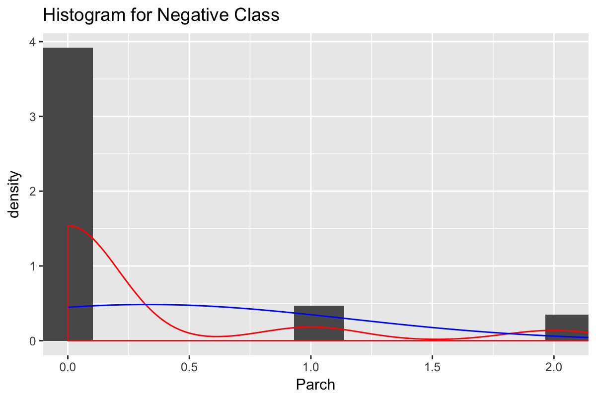
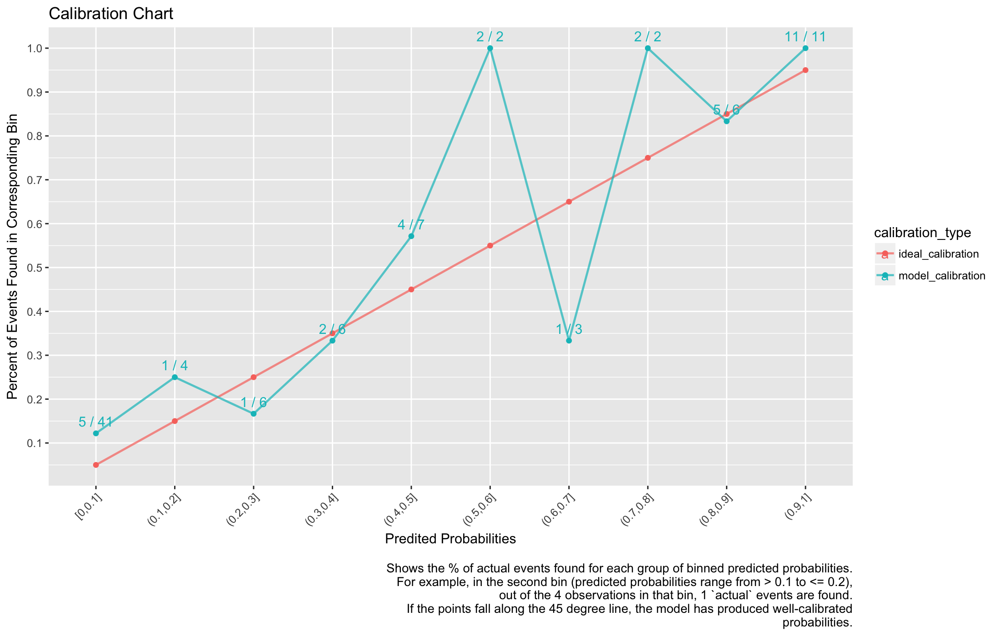

-   [Tuning Parameters](#tuning-parameters)
-   [Dataset](#dataset)
    -   [Summary](#summary)
    -   [Skewness](#skewness)
    -   [Outliers](#outliers)
    -   [Correlation & Collinearity](#correlation-collinearity)
        -   [Correlation](#correlation)
        -   [Collinearity Removal](#collinearity-removal)
    -   [Variable Importance](#variable-importance)
        -   [ROC Values](#roc-values)
    -   [Graphs of Predictors](#graphs-of-predictors)
        -   [Pclass](#pclass)
        -   [Sex](#sex)
        -   [Age](#age)
        -   [SibSp](#sibsp)
        -   [Parch](#parch)
        -   [Fare](#fare)
        -   [Embarked](#embarked)
-   [Spot-Check](#spot-check)
    -   [Configuration](#configuration)
        -   [Class Balance](#class-balance)
        -   [Training Data](#training-data)
        -   [Test](#test)
        -   [Testing train\_classification](#testing-train_classification)
    -   [Models](#models)
        -   [glm\_no\_pre\_process](#glm_no_pre_process)
        -   [glm\_basic\_processing](#glm_basic_processing)
        -   [glm\_remove\_collinearity\_caret](#glm_remove_collinearity_caret)
        -   [glm\_remove\_collinearity\_custom](#glm_remove_collinearity_custom)
        -   [glm\_yeojohnson](#glm_yeojohnson)
        -   [logistic\_regression\_stepwise\_backward](#logistic_regression_stepwise_backward)
        -   [linear\_discriminant\_analsysis](#linear_discriminant_analsysis)
        -   [linear\_discriminant\_analsysis\_remove\_collinear](#linear_discriminant_analsysis_remove_collinear)
        -   [linear\_discriminant\_analsysis\_remove\_collinear\_skew](#linear_discriminant_analsysis_remove_collinear_skew)
        -   [partial\_least\_squares\_discriminant\_analysis](#partial_least_squares_discriminant_analysis)
        -   [partial\_least\_squares\_discriminant\_analysis\_skew](#partial_least_squares_discriminant_analysis_skew)
        -   [glmnet\_lasso\_ridge](#glmnet_lasso_ridge)
        -   [sparse\_lda](#sparse_lda)
        -   [nearest\_shrunken\_centroids](#nearest_shrunken_centroids)
        -   [regularized\_discriminant\_analysis\_rc](#regularized_discriminant_analysis_rc)
        -   [mixture\_discriminant\_analysis](#mixture_discriminant_analysis)
        -   [mixture\_discriminant\_analysis\_rc](#mixture_discriminant_analysis_rc)
        -   [flexible\_discriminant\_analsysis](#flexible_discriminant_analsysis)
        -   [svm\_linear](#svm_linear)
        -   [svm\_polynomial](#svm_polynomial)
        -   [svm\_radial](#svm_radial)
        -   [k\_nearest\_neighbors](#k_nearest_neighbors)
        -   [naive\_bayes](#naive_bayes)
        -   [rpart\_independent\_categories](#rpart_independent_categories)
        -   [rpart\_grouped\_categories](#rpart_grouped_categories)
        -   [treebag\_independent\_categories](#treebag_independent_categories)
        -   [treebag\_grouped\_categories](#treebag_grouped_categories)
        -   [c50\_model\_independent\_categories](#c50_model_independent_categories)
        -   [c50\_rules\_model\_independent\_categories](#c50_rules_model_independent_categories)
        -   [rf\_independent\_categories](#rf_independent_categories)
        -   [rf\_grouped\_categories](#rf_grouped_categories)
        -   [adaboost\_independent\_categories](#adaboost_independent_categories)
        -   [adaboost\_grouped\_categories](#adaboost_grouped_categories)
        -   [adabag\_independent\_categories](#adabag_independent_categories)
        -   [adabag\_grouped\_categories](#adabag_grouped_categories)
        -   [gbm\_independent\_categories (stochastic gradient boosting)](#gbm_independent_categories-stochastic-gradient-boosting)
        -   [gbm\_grouped\_categories (stochastic gradient boosting)](#gbm_grouped_categories-stochastic-gradient-boosting)
        -   [All Models on Page 550 that are classification or both regression and classification](#all-models-on-page-550-that-are-classification-or-both-regression-and-classification)
        -   [Models used for spot-check.Rmd](#models-used-for-spot-check.rmd)
-   [Resamples & Top Models](#resamples-top-models)
    -   [Resamples](#resamples)
    -   [Train Top Models on Entire Training Dataset & Predict on Test Set](#train-top-models-on-entire-training-dataset-predict-on-test-set)
        -   [Random Forest (rf\_grouped\_categories)](#random-forest-rf_grouped_categories)
        -   [Random Forest (rf\_independent\_categories)](#random-forest-rf_independent_categories)
        -   [Stochastic Gradient Boosting (gbm\_independent\_categories)](#stochastic-gradient-boosting-gbm_independent_categories)
        -   [Stochastic Gradient Boosting (gbm\_grouped\_categories)](#stochastic-gradient-boosting-gbm_grouped_categories)
        -   [C5.0 (c50\_model\_independent\_categories)](#c5.0-c50_model_independent_categories)
        -   [Top Model Comparison](#top-model-comparison)

Tuning Parameters
=================

``` r
metric <- 'ROC'
# train/test set
training_percentage <- 0.90

# cross validation
cross_validation_num_folds <- 10
cross_validation_num_repeats <- 3

# tuning parameters
tuning_number_of_latent_variables_to_retain <- 1:10

tuning_glmnet_alpha <- seq(from = 0, to = 1, length = 5) # alpha = 0 is pure ridge regression, and alpha = 1 is pure lasso regression.
tuning_glmnet_lambda <- seq(from = 0.0001, to = 1, length = 50) # lambda values control the amount of penalization in the model.

tuning_nearest_shrunken_centroids_shrinkage_threshold <- data.frame(threshold = 0:25)

tuning_mda_subclasses <- 1:8

tuning_rda_lambda <- seq(from = 0, to = 1, by = 0.2)
tuning_rda_gamma <- seq(from = 0, to = 1, by = 0.2)

tuning_nnet_size <- 1:10
tuning_nnet_decay <- c(0, 0.1, 1, 2)
parameter_nnet_linout <- FALSE
parameter_nnet_max_iterations <- 2000

tuning_svm_linear_num_costs <- 5
tuning_svm_poly_num_costs <- 3
tuning_svm_radial_num_costs <- 6

tuning_knn_tuning_grid <- data.frame(k = c(4 * (0:5) + 1, 20 * (2:5) + 1, 50 * (3:9) + 1))

tuning_naive_bayes_laplace_correction <- c(0, 0.5, 1, 2)
tuning_naive_bayes_distribution_type <- c(TRUE, FALSE)
tuning_naive_bayes_bandwidth_adjustment <- c(0, 0.5, 1.0)

tuning_gbm_shrinkage <- c(0.01, 0.10, 0.50)
tuning_gbm_num_boosting_iterations <- floor(seq(from = 50, to = 5000, length.out = 3))
tuning_gbm_max_tree_depth <- c(1, 5, 9)
tuning_gbm_min_terminal_node_size <- c(5, 15, 25)
```

Dataset
=======

> Assumes the dataset has factors for strings; logical for TRUE/FALSE; `target` for outcome variable

Summary
-------

> Total predictors: `7`

> Total data-points/rows: `891`

> Number of training data-points: `802`

Rule of thumbs for dimensions (Probabilistic and Statistical Modeling in Computer Science; pg 430):

> r &lt; sqrt(n); where r is the number of predictors and sqrt(n) is the square root of the sample size (`30`): `TRUE`

> r &lt; sqrt(n\_t); where r is the number of predictors and sqrt(n\_t) is the square root of the training set size (`28`): `TRUE`

    ##    target        Pclass          Sex           Age            SibSp           Parch             Fare        Embarked
    ##  lived:342   Min.   :1.000   female:314   Min.   : 0.42   Min.   :0.000   Min.   :0.0000   Min.   :  0.00    :  2   
    ##  died :549   1st Qu.:2.000   male  :577   1st Qu.:20.12   1st Qu.:0.000   1st Qu.:0.0000   1st Qu.:  7.91   C:168   
    ##              Median :3.000                Median :28.00   Median :0.000   Median :0.0000   Median : 14.45   Q: 77   
    ##              Mean   :2.309                Mean   :29.70   Mean   :0.523   Mean   :0.3816   Mean   : 32.20   S:644   
    ##              3rd Qu.:3.000                3rd Qu.:38.00   3rd Qu.:1.000   3rd Qu.:0.0000   3rd Qu.: 31.00           
    ##              Max.   :3.000                Max.   :80.00   Max.   :8.000   Max.   :6.0000   Max.   :512.33           
    ##                                           NA's   :177

Skewness
--------

Note: `Box-Cox` can only be applied to sets (i.e. predictors) where all values are `> 0`. So some/most/all? `NA`s will be from that limiation.

| column   |  boxcox\_skewness|
|:---------|-----------------:|
| target   |                NA|
| Pclass   |        -0.6284264|
| Sex      |                NA|
| Age      |                NA|
| SibSp    |                NA|
| Parch    |                NA|
| Fare     |                NA|
| Embarked |                NA|

Outliers
--------

| columns | lower\_outlier\_count | upper\_outlier\_count |
|:--------|:----------------------|:----------------------|
| Pclass  | 0                     | 0                     |
| Age     | 0                     | 2                     |
| SibSp   | 0                     | 30                    |
| Parch   | 0                     | 213                   |
| Fare    | 0                     | 92                    |

Correlation & Collinearity
--------------------------

### Correlation


### Collinearity Removal

#### Caret's `findCorrelation`

Shows caret's recommendation of removing collinear columns based on correlation threshold of `0.9`

> columns recommended for removal: \`\`

> final columns recommended: `target, Pclass, Sex, Age, SibSp, Parch, Fare, Embarked`

#### Heuristic

This method is described in APM pg 47 as the following steps

-   calculate the correlation matrix of predictors
-   determine the two predictors associated with the largest absolute pairwise correlation (call them predictors `A` and `B`)
-   Determine the average correlation between `A` and the other variables.
    -   Do the same for `B`
-   If `A` has a larger average correlation, remove it; otherwise, remove predcitor `B`
-   Repeat until no absolute correlations are above the threshold (`0.9`)

> columns recommended for removal: \`\`

> final columns recommended: `Pclass, Age, SibSp, Parch, Fare, target, Sex, Embarked`

Variable Importance
-------------------

### ROC Values

> "If the predictor could perfectly separate the classes, there would be a cutoff for the predictor that would achieve a sensitivity oand specificity of 1 and the area under the curve would be one. \[A\] completely irrelevant predictor would have an area under the curve of approximately 0.5."

|          |      lived|       died|
|----------|----------:|----------:|
| Pclass   |  0.6814170|  0.6814170|
| Sex      |  0.7668728|  0.7668728|
| Age      |  0.5617231|  0.5617231|
| SibSp    |  0.5431619|  0.5431619|
| Parch    |  0.5612171|  0.5612171|
| Fare     |  0.6921223|  0.6921223|
| Embarked |  0.5779354|  0.5779354|

Graphs of Predictors
--------------------

### Pclass


> statistically different means (check assumptions for t-test): `TRUE`

\*The Wilcoxon-Matt-Whitney test (or Wilcoxon rank sum test, or Mann-Whitney U-test) is used when is asked to compare the means of two groups that do not follow a normal distribution: it is a non-parametrical test. (<https://www.r-bloggers.com/wilcoxon-mann-whitney-rank-sum-test-or-test-u/)*>

> statistically different means (Wilcoxon-Matt-Whitney): `TRUE`

### Sex


> Chi-Square p-value: `0`

### Age

    Warning: Removed 177 rows containing non-finite values (stat_bin).

    Warning: Removed 177 rows containing non-finite values (stat_density).


    Warning: Removed 52 rows containing non-finite values (stat_bin).

    Warning: Removed 52 rows containing non-finite values (stat_density).


    Warning: Removed 125 rows containing non-finite values (stat_bin).

    Warning: Removed 125 rows containing non-finite values (stat_density).


    Warning: Removed 125 rows containing non-finite values (stat_boxplot).


    Warning: Removed 177 rows containing non-finite values (stat_boxplot).


> statistically different means (check assumptions for t-test): `TRUE`

\*The Wilcoxon-Matt-Whitney test (or Wilcoxon rank sum test, or Mann-Whitney U-test) is used when is asked to compare the means of two groups that do not follow a normal distribution: it is a non-parametrical test. (<https://www.r-bloggers.com/wilcoxon-mann-whitney-rank-sum-test-or-test-u/)*>

> statistically different means (Wilcoxon-Matt-Whitney): `FALSE`

### SibSp


> statistically different means (check assumptions for t-test): `FALSE`

\*The Wilcoxon-Matt-Whitney test (or Wilcoxon rank sum test, or Mann-Whitney U-test) is used when is asked to compare the means of two groups that do not follow a normal distribution: it is a non-parametrical test. (<https://www.r-bloggers.com/wilcoxon-mann-whitney-rank-sum-test-or-test-u/)*>

> statistically different means (Wilcoxon-Matt-Whitney): `TRUE`

### Parch



> statistically different means (check assumptions for t-test): `TRUE`

\*The Wilcoxon-Matt-Whitney test (or Wilcoxon rank sum test, or Mann-Whitney U-test) is used when is asked to compare the means of two groups that do not follow a normal distribution: it is a non-parametrical test. (<https://www.r-bloggers.com/wilcoxon-mann-whitney-rank-sum-test-or-test-u/)*>

> statistically different means (Wilcoxon-Matt-Whitney): `TRUE`

### Fare


> statistically different means (check assumptions for t-test): `TRUE`

\*The Wilcoxon-Matt-Whitney test (or Wilcoxon rank sum test, or Mann-Whitney U-test) is used when is asked to compare the means of two groups that do not follow a normal distribution: it is a non-parametrical test. (<https://www.r-bloggers.com/wilcoxon-mann-whitney-rank-sum-test-or-test-u/)*>

> statistically different means (Wilcoxon-Matt-Whitney): `TRUE`

### Embarked


    Warning in chisq.test(count_table): Chi-squared approximation may be incorrect


> Chi-Square p-value: `0`

Spot-Check
==========

Configuration
-------------

### Class Balance

Make sure class balance is even amount training/test datasets.

### Training Data

    ## 
    ##     lived      died 
    ## 0.3835616 0.6164384

### Test

    ## 
    ##     lived      died 
    ## 0.3863636 0.6136364

> Using `10`-fold cross-validation with `3` repeats, using the `ROC` statistic to evaluate each model.

> used `90%` of data for `training` set (`803`), and `10%` for `test` set (`88`).

### Testing train\_classification

> NOTE that for logistic regression (GLM), caret's `train()` (because of `glm()`) uses the second-level factor value as the success/postive event but `resamples()` uses the first-level as the success event. The result is either the `sensitivity` and `specificity` for `resamples()` will be reversed (and so I would be unable to compare apples to apples with other models), or I need to keep the first-level factor as the positive event (the default approach), which will mean that THE COEFFICIENTS WILL BE REVERSED, MAKIN THE MODEL RELATIVE TO THE NEGATIVE EVENT. I chose the latter, in order to compare models below, but this means that when using the logistic model to explain the data, the reader needs to mentally reverse the direction/sign of the coefficients, or correct the problem in the final stages of model building.

> NOTE: "Logistic regression does not make many of the key assumptions of linear regression and general linear models that are based on ordinary least squares algorithms – particularly regarding linearity, normality, homoscedasticity, and measurement level." [link](http://www.statisticssolutions.com/assumptions-of-logistic-regression/)

Models
------

### glm\_no\_pre\_process

> Mean ROC cutoff: `0.422605718340932`

#### Model Summary


    Call:
    NULL

    Deviance Residuals: 
        Min       1Q   Median       3Q      Max  
    -2.4403  -0.6166   0.4126   0.5783   2.6291  

    Coefficients:
                  Estimate Std. Error z value             Pr(>|z|)    
    (Intercept) -16.747226 535.411556  -0.031              0.97505    
    Pclass        1.109486   0.150029   7.395    0.000000000000141 ***
    Sexmale       2.684648   0.209085  12.840 < 0.0000000000000002 ***
    Age           0.036086   0.008232   4.384    0.000011657312148 ***
    SibSp         0.307422   0.114692   2.680              0.00735 ** 
    Parch         0.047827   0.131710   0.363              0.71651    
    Fare         -0.002071   0.002470  -0.838              0.40183    
    EmbarkedC    11.654929 535.411286   0.022              0.98263    
    EmbarkedQ    11.700310 535.411346   0.022              0.98257    
    EmbarkedS    12.052285 535.411264   0.023              0.98204    
    ---
    Signif. codes:  0 '***' 0.001 '**' 0.01 '*' 0.05 '.' 0.1 ' ' 1

    (Dispersion parameter for binomial family taken to be 1)

        Null deviance: 1069.2  on 802  degrees of freedom
    Residual deviance:  704.1  on 793  degrees of freedom
    AIC: 724.1

    Number of Fisher Scoring iterations: 12

#### Model Predictors

    [1] "Pclass"    "Sexmale"   "Age"       "SibSp"     "Parch"     "Fare"      "EmbarkedC" "EmbarkedQ" "EmbarkedS"

#### Variable Importance

    glm variable importance

      Overall
     12.83997
      7.39513
      4.38390
      2.68041
      0.83836
      0.36313
      0.02251
      0.02185
      0.02177

### glm\_basic\_processing

> Mean ROC cutoff: `0.422605718340922`

#### Model Summary


    Call:
    NULL

    Deviance Residuals: 
        Min       1Q   Median       3Q      Max  
    -2.4403  -0.6166   0.4126   0.5783   2.6291  

    Coefficients:
                 Estimate Std. Error z value             Pr(>|z|)    
    (Intercept)   0.63908    0.67377   0.949              0.34286    
    Pclass        0.93359    0.12624   7.395    0.000000000000141 ***
    Sexmale       1.28638    0.10019  12.840 < 0.0000000000000002 ***
    Age           0.46591    0.10628   4.384    0.000011657312148 ***
    SibSp         0.34398    0.12833   2.680              0.00735 ** 
    Parch         0.03726    0.10260   0.363              0.71651    
    Fare         -0.10531    0.12561  -0.838              0.40183    
    EmbarkedC     4.58002  210.39962   0.022              0.98263    
    EmbarkedQ     3.30258  151.12754   0.022              0.98257    
    EmbarkedS     5.40864  240.27348   0.023              0.98204    
    ---
    Signif. codes:  0 '***' 0.001 '**' 0.01 '*' 0.05 '.' 0.1 ' ' 1

    (Dispersion parameter for binomial family taken to be 1)

        Null deviance: 1069.2  on 802  degrees of freedom
    Residual deviance:  704.1  on 793  degrees of freedom
    AIC: 724.1

    Number of Fisher Scoring iterations: 12

#### Model Predictors

    [1] "Pclass"    "Sexmale"   "Age"       "SibSp"     "Parch"     "Fare"      "EmbarkedC" "EmbarkedQ" "EmbarkedS"

#### Variable Importance

    glm variable importance

      Overall
     12.83997
      7.39513
      4.38390
      2.68041
      0.83836
      0.36313
      0.02251
      0.02185
      0.02177

### glm\_remove\_collinearity\_caret

> No collinear columns removed... skipping.

### glm\_remove\_collinearity\_custom

> No collinear columns removed... skipping.

### glm\_yeojohnson

> Mean ROC cutoff: `0.422605718340922`

#### Model Summary


    Call:
    NULL

    Deviance Residuals: 
        Min       1Q   Median       3Q      Max  
    -2.4403  -0.6166   0.4126   0.5783   2.6291  

    Coefficients:
                 Estimate Std. Error z value             Pr(>|z|)    
    (Intercept)   0.63908    0.67377   0.949              0.34286    
    Pclass        0.93359    0.12624   7.395    0.000000000000141 ***
    Sexmale       1.28638    0.10019  12.840 < 0.0000000000000002 ***
    Age           0.46591    0.10628   4.384    0.000011657312148 ***
    SibSp         0.34398    0.12833   2.680              0.00735 ** 
    Parch         0.03726    0.10260   0.363              0.71651    
    Fare         -0.10531    0.12561  -0.838              0.40183    
    EmbarkedC     4.58002  210.39962   0.022              0.98263    
    EmbarkedQ     3.30258  151.12754   0.022              0.98257    
    EmbarkedS     5.40864  240.27348   0.023              0.98204    
    ---
    Signif. codes:  0 '***' 0.001 '**' 0.01 '*' 0.05 '.' 0.1 ' ' 1

    (Dispersion parameter for binomial family taken to be 1)

        Null deviance: 1069.2  on 802  degrees of freedom
    Residual deviance:  704.1  on 793  degrees of freedom
    AIC: 724.1

    Number of Fisher Scoring iterations: 12

#### Model Predictors

    [1] "Pclass"    "Sexmale"   "Age"       "SibSp"     "Parch"     "Fare"      "EmbarkedC" "EmbarkedQ" "EmbarkedS"

#### Variable Importance

    glm variable importance

      Overall
     12.83997
      7.39513
      4.38390
      2.68041
      0.83836
      0.36313
      0.02251
      0.02185
      0.02177

### logistic\_regression\_stepwise\_backward

> Mean ROC cutoff: `0.410053424295532`

#### Model Summary


    Call:
    NULL

    Deviance Residuals: 
        Min       1Q   Median       3Q      Max  
    -2.4232  -0.6054   0.4109   0.5725   2.6464  

    Coefficients:
                Estimate Std. Error z value             Pr(>|z|)    
    (Intercept)  0.66238    0.09610   6.893     0.00000000000548 ***
    Sexmale      1.30054    0.09736  13.358 < 0.0000000000000002 ***
    Pclass       0.99802    0.10597   9.418 < 0.0000000000000002 ***
    Age          0.46864    0.10500   4.463     0.00000807118933 ***
    SibSp        0.36098    0.11999   3.008              0.00263 ** 
    ---
    Signif. codes:  0 '***' 0.001 '**' 0.01 '*' 0.05 '.' 0.1 ' ' 1

    (Dispersion parameter for binomial family taken to be 1)

        Null deviance: 1069.24  on 802  degrees of freedom
    Residual deviance:  709.34  on 798  degrees of freedom
    AIC: 719.34

    Number of Fisher Scoring iterations: 5

#### Model Predictors

    [1] "Sexmale" "Pclass"  "Age"     "SibSp"  

#### Variable Importance

    glm variable importance

     Overall
      13.358
       9.418
       4.463
       3.008

### linear\_discriminant\_analsysis

> Mean ROC cutoff: `0.381681239259711`

#### Model Summary

                Length Class      Mode     
    prior        2     -none-     numeric  
    counts       2     -none-     numeric  
    means       18     -none-     numeric  
    scaling      9     -none-     numeric  
    lev          2     -none-     character
    svd          1     -none-     numeric  
    N            1     -none-     numeric  
    call         3     -none-     call     
    xNames       9     -none-     character
    problemType  1     -none-     character
    tuneValue    1     data.frame list     
    obsLevels    2     -none-     character
    param        0     -none-     list     

#### Model Predictors

    [1] "Pclass"    "Sexmale"   "Age"       "SibSp"     "Parch"     "Fare"      "EmbarkedC" "EmbarkedQ" "EmbarkedS"

#### Variable Importance

    ROC curve variable importance

     Importance
         0.7694
         0.7001
         0.6916
         0.5748
         0.5645
         0.5485
         0.5116

### linear\_discriminant\_analsysis\_remove\_collinear

> No collinear columns removed... skipping.

### linear\_discriminant\_analsysis\_remove\_collinear\_skew

> Mean ROC cutoff: `0.381681239259711`

#### Model Summary

                Length Class      Mode     
    prior        2     -none-     numeric  
    counts       2     -none-     numeric  
    means       18     -none-     numeric  
    scaling      9     -none-     numeric  
    lev          2     -none-     character
    svd          1     -none-     numeric  
    N            1     -none-     numeric  
    call         3     -none-     call     
    xNames       9     -none-     character
    problemType  1     -none-     character
    tuneValue    1     data.frame list     
    obsLevels    2     -none-     character
    param        0     -none-     list     

#### Model Predictors

    [1] "Pclass"    "Sexmale"   "Age"       "SibSp"     "Parch"     "Fare"      "EmbarkedC" "EmbarkedQ" "EmbarkedS"

#### Variable Importance

    ROC curve variable importance

     Importance
         0.7694
         0.7001
         0.6916
         0.5748
         0.5645
         0.5485
         0.5116

### partial\_least\_squares\_discriminant\_analysis

> Mean ROC cutoff: `0.447829161114397`Data: X dimension: 803 9 Y dimension: 803 2 Fit method: oscorespls Number of components considered: 1 TRAINING: % variance explained

#### Model Predictors

    [1] "Pclass"    "Sexmale"   "Age"       "SibSp"     "Parch"     "Fare"      "EmbarkedC" "EmbarkedQ" "EmbarkedS"

#### Model Tuning Grid Performance


#### Variable Importance

    pls variable importance

       Overall
     0.1576672
     0.1031994
     0.0772198
     0.0475735
     0.0429209
     0.0264027
     0.0124126
     0.0085892
     0.0003942

### partial\_least\_squares\_discriminant\_analysis\_skew

> Mean ROC cutoff: `0.447829161114397`Data: X dimension: 803 9 Y dimension: 803 2 Fit method: oscorespls Number of components considered: 1 TRAINING: % variance explained

#### Model Predictors

    [1] "Pclass"    "Sexmale"   "Age"       "SibSp"     "Parch"     "Fare"      "EmbarkedC" "EmbarkedQ" "EmbarkedS"

#### Model Tuning Grid Performance


#### Variable Importance

    pls variable importance

       Overall
     0.1576672
     0.1031994
     0.0772198
     0.0475735
     0.0429209
     0.0264027
     0.0124126
     0.0085892
     0.0003942

### glmnet\_lasso\_ridge

> Mean ROC cutoff: `0.417529548194998`

#### Model Summary

                Length Class      Mode     
    a0          100    -none-     numeric  
    beta        900    dgCMatrix  S4       
    df          100    -none-     numeric  
    dim           2    -none-     numeric  
    lambda      100    -none-     numeric  
    dev.ratio   100    -none-     numeric  
    nulldev       1    -none-     numeric  
    npasses       1    -none-     numeric  
    jerr          1    -none-     numeric  
    offset        1    -none-     logical  
    classnames    2    -none-     character
    call          5    -none-     call     
    nobs          1    -none-     numeric  
    lambdaOpt     1    -none-     numeric  
    xNames        9    -none-     character
    problemType   1    -none-     character
    tuneValue     2    data.frame list     
    obsLevels     2    -none-     character
    param         0    -none-     list     

#### Model Predictors

    [1] "Pclass"    "Sexmale"   "Age"       "SibSp"     "Parch"     "Fare"      "EmbarkedC" "EmbarkedQ" "EmbarkedS"

#### Model Tuning Grid Performance


#### Variable Importance

    glmnet variable importance

     Overall
     1.05437
     0.68451
     0.31011
     0.23493
     0.15746
     0.09659
     0.07213
     0.02280
     0.01715

### sparse\_lda

> Mean ROC cutoff: `0.366683845277598`

#### Model Summary

                Length Class      Mode     
    call        5      -none-     call     
    beta        7      -none-     numeric  
    theta       2      -none-     numeric  
    varNames    7      -none-     character
    varIndex    7      -none-     numeric  
    origP       1      -none-     numeric  
    rss         1      -none-     numeric  
    fit         8      lda        list     
    classes     2      -none-     character
    lambda      1      -none-     numeric  
    stop        1      -none-     numeric  
    xNames      9      -none-     character
    problemType 1      -none-     character
    tuneValue   2      data.frame list     
    obsLevels   2      -none-     character
    param       0      -none-     list     

#### Model Predictors

    [1] "Pclass"    "Sexmale"   "Age"       "SibSp"     "Parch"     "Fare"      "EmbarkedS"

#### Model Tuning Grid Performance


#### Variable Importance

    ROC curve variable importance

     Importance
         0.7694
         0.7001
         0.6916
         0.5748
         0.5645
         0.5485
         0.5116

### nearest\_shrunken\_centroids

> was causing an error, turned off

### regularized\_discriminant\_analysis\_rc

> No collinear columns removed... skipping.

### mixture\_discriminant\_analysis

> Mean ROC cutoff: `0.381698717505503`

#### Model Summary

                      Length Class      Mode     
    percent.explained 1      -none-     numeric  
    values            1      -none-     numeric  
    means             2      -none-     numeric  
    theta.mod         1      -none-     numeric  
    dimension         1      -none-     numeric  
    sub.prior         2      -none-     list     
    fit               5      polyreg    list     
    call              4      -none-     call     
    weights           2      -none-     list     
    prior             2      table      numeric  
    assign.theta      2      -none-     list     
    deviance          1      -none-     numeric  
    confusion         4      table      numeric  
    terms             3      terms      call     
    xNames            9      -none-     character
    problemType       1      -none-     character
    tuneValue         1      data.frame list     
    obsLevels         2      -none-     character
    param             0      -none-     list     

#### Model Predictors

    [1] "Pclass"    "Sexmale"   "Age"       "SibSp"     "Parch"     "Fare"      "EmbarkedC" "EmbarkedQ" "EmbarkedS"

#### Model Tuning Grid Performance


#### Variable Importance

    ROC curve variable importance

     Importance
         0.7694
         0.7001
         0.6916
         0.5748
         0.5645
         0.5485
         0.5116

### mixture\_discriminant\_analysis\_rc

> No collinear columns removed... skipping.

### flexible\_discriminant\_analsysis

> Mean ROC cutoff: `0.344304993737411`

#### Model Summary

                      Length Class      Mode     
    percent.explained  1     -none-     numeric  
    values             1     -none-     numeric  
    means              2     -none-     numeric  
    theta.mod          1     -none-     numeric  
    dimension          1     -none-     numeric  
    prior              2     table      numeric  
    fit               29     earth      list     
    call               7     -none-     call     
    terms              3     terms      call     
    confusion          4     table      numeric  
    xNames             9     -none-     character
    problemType        1     -none-     character
    tuneValue          2     data.frame list     
    obsLevels          2     -none-     character
    param              0     -none-     list     

#### Model Predictors

    [1] "Sexmale" "Pclass"  "Age"     "SibSp"   "Fare"    "Parch"  

#### Model Tuning Grid Performance


#### Variable Importance

    fda variable importance

     Overall
     100.000
      48.906
      33.877
      28.629
      26.971
       9.216
       0.000
       0.000
       0.000

### svm\_linear

> Mean ROC cutoff: `0.317212147873164`

#### Model Summary


    Call:
    svm.default(x = as.matrix(x), y = y, kernel = "linear", cost = param$cost, probability = classProbs)


    Parameters:
       SVM-Type:  C-classification 
     SVM-Kernel:  linear 
           cost:  0.5 
          gamma:  0.1111111 

    Number of Support Vectors:  367

     ( 186 181 )


    Number of Classes:  2 

    Levels: 
     lived died

#### Model Predictors

    [1] "Pclass"    "Sexmale"   "Age"       "SibSp"     "Parch"     "Fare"      "EmbarkedC" "EmbarkedQ" "EmbarkedS"

#### Model Tuning Grid Performance


#### Variable Importance

    ROC curve variable importance

     Importance
         0.7694
         0.7001
         0.6916
         0.5748
         0.5645
         0.5485
         0.5116

### svm\_polynomial

### svm\_radial

### k\_nearest\_neighbors

> Mean ROC cutoff: `0.381884451690275`

#### Model Summary

                Length Class      Mode     
    learn       2      -none-     list     
    k           1      -none-     numeric  
    theDots     0      -none-     list     
    xNames      9      -none-     character
    problemType 1      -none-     character
    tuneValue   1      data.frame list     
    obsLevels   2      -none-     character
    param       0      -none-     list     

#### Model Predictors

    [1] "Pclass"    "Sexmale"   "Age"       "SibSp"     "Parch"     "Fare"      "EmbarkedC" "EmbarkedQ" "EmbarkedS"

#### Model Tuning Grid Performance


#### Variable Importance

    ROC curve variable importance

     Importance
         0.7694
         0.7001
         0.6916
         0.5748
         0.5645
         0.5485
         0.5116

### naive\_bayes

    Warning in FUN(X[[i]], ...): Numerical 0 probability for all classes with observation 37

    Warning in FUN(X[[i]], ...): Numerical 0 probability for all classes with observation 44

    Warning in FUN(X[[i]], ...): Numerical 0 probability for all classes with observation 70

    Warning in FUN(X[[i]], ...): Numerical 0 probability for all classes with observation 76

    Warning in FUN(X[[i]], ...): Numerical 0 probability for all classes with observation 4

    Warning in FUN(X[[i]], ...): Numerical 0 probability for all classes with observation 34

    Warning in FUN(X[[i]], ...): Numerical 0 probability for all classes with observation 54

    Warning in FUN(X[[i]], ...): Numerical 0 probability for all classes with observation 74

    Warning in FUN(X[[i]], ...): Numerical 0 probability for all classes with observation 4

    Warning in FUN(X[[i]], ...): Numerical 0 probability for all classes with observation 69

    Warning in FUN(X[[i]], ...): Numerical 0 probability for all classes with observation 9

    Warning in FUN(X[[i]], ...): Numerical 0 probability for all classes with observation 26

    Warning in FUN(X[[i]], ...): Numerical 0 probability for all classes with observation 35

    Warning in FUN(X[[i]], ...): Numerical 0 probability for all classes with observation 58

    Warning in FUN(X[[i]], ...): Numerical 0 probability for all classes with observation 11

    Warning in FUN(X[[i]], ...): Numerical 0 probability for all classes with observation 12

    Warning in FUN(X[[i]], ...): Numerical 0 probability for all classes with observation 18

    Warning in FUN(X[[i]], ...): Numerical 0 probability for all classes with observation 37

    Warning in FUN(X[[i]], ...): Numerical 0 probability for all classes with observation 42

    Warning in FUN(X[[i]], ...): Numerical 0 probability for all classes with observation 77

    Warning in FUN(X[[i]], ...): Numerical 0 probability for all classes with observation 5

    Warning in FUN(X[[i]], ...): Numerical 0 probability for all classes with observation 23

    Warning in FUN(X[[i]], ...): Numerical 0 probability for all classes with observation 55

    Warning in FUN(X[[i]], ...): Numerical 0 probability for all classes with observation 78

    Warning in FUN(X[[i]], ...): Numerical 0 probability for all classes with observation 12

    Warning in FUN(X[[i]], ...): Numerical 0 probability for all classes with observation 22

    Warning in FUN(X[[i]], ...): Numerical 0 probability for all classes with observation 26

    Warning in FUN(X[[i]], ...): Numerical 0 probability for all classes with observation 34

    Warning in FUN(X[[i]], ...): Numerical 0 probability for all classes with observation 39

    Warning in FUN(X[[i]], ...): Numerical 0 probability for all classes with observation 70

    Warning in FUN(X[[i]], ...): Numerical 0 probability for all classes with observation 14

    Warning in FUN(X[[i]], ...): Numerical 0 probability for all classes with observation 32

    Warning in FUN(X[[i]], ...): Numerical 0 probability for all classes with observation 57

    Warning in FUN(X[[i]], ...): Numerical 0 probability for all classes with observation 81

    Warning in FUN(X[[i]], ...): Numerical 0 probability for all classes with observation 2

    Warning in FUN(X[[i]], ...): Numerical 0 probability for all classes with observation 4

    Warning in FUN(X[[i]], ...): Numerical 0 probability for all classes with observation 19

    Warning in FUN(X[[i]], ...): Numerical 0 probability for all classes with observation 21

    Warning in FUN(X[[i]], ...): Numerical 0 probability for all classes with observation 28

    Warning in FUN(X[[i]], ...): Numerical 0 probability for all classes with observation 51

    Warning in FUN(X[[i]], ...): Numerical 0 probability for all classes with observation 55

    Warning in FUN(X[[i]], ...): Numerical 0 probability for all classes with observation 7

    Warning in FUN(X[[i]], ...): Numerical 0 probability for all classes with observation 2

    Warning in FUN(X[[i]], ...): Numerical 0 probability for all classes with observation 9

    Warning in FUN(X[[i]], ...): Numerical 0 probability for all classes with observation 21

    Warning in FUN(X[[i]], ...): Numerical 0 probability for all classes with observation 22

    Warning in FUN(X[[i]], ...): Numerical 0 probability for all classes with observation 30

    Warning in FUN(X[[i]], ...): Numerical 0 probability for all classes with observation 53

    Warning in FUN(X[[i]], ...): Numerical 0 probability for all classes with observation 4

    Warning in FUN(X[[i]], ...): Numerical 0 probability for all classes with observation 12

    Warning in FUN(X[[i]], ...): Numerical 0 probability for all classes with observation 15

    Warning in FUN(X[[i]], ...): Numerical 0 probability for all classes with observation 27

    Warning in FUN(X[[i]], ...): Numerical 0 probability for all classes with observation 75

    Warning in FUN(X[[i]], ...): Numerical 0 probability for all classes with observation 81

    Warning in FUN(X[[i]], ...): Numerical 0 probability for all classes with observation 14

    Warning in FUN(X[[i]], ...): Numerical 0 probability for all classes with observation 57

    Warning in FUN(X[[i]], ...): Numerical 0 probability for all classes with observation 61

    Warning in FUN(X[[i]], ...): Numerical 0 probability for all classes with observation 67

    Warning in FUN(X[[i]], ...): Numerical 0 probability for all classes with observation 22

    Warning in FUN(X[[i]], ...): Numerical 0 probability for all classes with observation 11

    Warning in FUN(X[[i]], ...): Numerical 0 probability for all classes with observation 40

    Warning in FUN(X[[i]], ...): Numerical 0 probability for all classes with observation 16

    Warning in FUN(X[[i]], ...): Numerical 0 probability for all classes with observation 17

    Warning in FUN(X[[i]], ...): Numerical 0 probability for all classes with observation 28

    Warning in FUN(X[[i]], ...): Numerical 0 probability for all classes with observation 38

    Warning in FUN(X[[i]], ...): Numerical 0 probability for all classes with observation 42

    Warning in FUN(X[[i]], ...): Numerical 0 probability for all classes with observation 61

    Warning in FUN(X[[i]], ...): Numerical 0 probability for all classes with observation 1

    Warning in FUN(X[[i]], ...): Numerical 0 probability for all classes with observation 34

    Warning in FUN(X[[i]], ...): Numerical 0 probability for all classes with observation 42

    Warning in FUN(X[[i]], ...): Numerical 0 probability for all classes with observation 70

    Warning in FUN(X[[i]], ...): Numerical 0 probability for all classes with observation 3

    Warning in FUN(X[[i]], ...): Numerical 0 probability for all classes with observation 22

    Warning in FUN(X[[i]], ...): Numerical 0 probability for all classes with observation 26

    Warning in FUN(X[[i]], ...): Numerical 0 probability for all classes with observation 29

    Warning in FUN(X[[i]], ...): Numerical 0 probability for all classes with observation 45

    Warning in FUN(X[[i]], ...): Numerical 0 probability for all classes with observation 76

    Warning in FUN(X[[i]], ...): Numerical 0 probability for all classes with observation 78

    Warning in FUN(X[[i]], ...): Numerical 0 probability for all classes with observation 25

    Warning in FUN(X[[i]], ...): Numerical 0 probability for all classes with observation 50

    Warning in FUN(X[[i]], ...): Numerical 0 probability for all classes with observation 62

    Warning in FUN(X[[i]], ...): Numerical 0 probability for all classes with observation 16

    Warning in FUN(X[[i]], ...): Numerical 0 probability for all classes with observation 68

    Warning in FUN(X[[i]], ...): Numerical 0 probability for all classes with observation 72

    Warning in FUN(X[[i]], ...): Numerical 0 probability for all classes with observation 25

    Warning in FUN(X[[i]], ...): Numerical 0 probability for all classes with observation 26

    Warning in FUN(X[[i]], ...): Numerical 0 probability for all classes with observation 32

    Warning in FUN(X[[i]], ...): Numerical 0 probability for all classes with observation 57

    Warning in FUN(X[[i]], ...): Numerical 0 probability for all classes with observation 72

    Warning in FUN(X[[i]], ...): Numerical 0 probability for all classes with observation 1

    Warning in FUN(X[[i]], ...): Numerical 0 probability for all classes with observation 14

    Warning in FUN(X[[i]], ...): Numerical 0 probability for all classes with observation 21

    Warning in FUN(X[[i]], ...): Numerical 0 probability for all classes with observation 22

    Warning in FUN(X[[i]], ...): Numerical 0 probability for all classes with observation 26

    Warning in FUN(X[[i]], ...): Numerical 0 probability for all classes with observation 27

    Warning in FUN(X[[i]], ...): Numerical 0 probability for all classes with observation 30

    Warning in FUN(X[[i]], ...): Numerical 0 probability for all classes with observation 73

    Warning in FUN(X[[i]], ...): Numerical 0 probability for all classes with observation 30

    Warning in FUN(X[[i]], ...): Numerical 0 probability for all classes with observation 44

    Warning in FUN(X[[i]], ...): Numerical 0 probability for all classes with observation 2

    Warning in FUN(X[[i]], ...): Numerical 0 probability for all classes with observation 39

    Warning in FUN(X[[i]], ...): Numerical 0 probability for all classes with observation 53

    Warning in FUN(X[[i]], ...): Numerical 0 probability for all classes with observation 55

    Warning in FUN(X[[i]], ...): Numerical 0 probability for all classes with observation 63

    Warning in FUN(X[[i]], ...): Numerical 0 probability for all classes with observation 77

    Warning in FUN(X[[i]], ...): Numerical 0 probability for all classes with observation 4

    Warning in FUN(X[[i]], ...): Numerical 0 probability for all classes with observation 5

    Warning in FUN(X[[i]], ...): Numerical 0 probability for all classes with observation 50

    Warning in FUN(X[[i]], ...): Numerical 0 probability for all classes with observation 66

    Warning in FUN(X[[i]], ...): Numerical 0 probability for all classes with observation 74

    Warning in FUN(X[[i]], ...): Numerical 0 probability for all classes with observation 69

    Warning in FUN(X[[i]], ...): Numerical 0 probability for all classes with observation 5

    Warning in FUN(X[[i]], ...): Numerical 0 probability for all classes with observation 9

    Warning in FUN(X[[i]], ...): Numerical 0 probability for all classes with observation 14

    Warning in FUN(X[[i]], ...): Numerical 0 probability for all classes with observation 44

    Warning in FUN(X[[i]], ...): Numerical 0 probability for all classes with observation 5

    Warning in FUN(X[[i]], ...): Numerical 0 probability for all classes with observation 24

    Warning in FUN(X[[i]], ...): Numerical 0 probability for all classes with observation 36

    Warning in FUN(X[[i]], ...): Numerical 0 probability for all classes with observation 56

    Warning in FUN(X[[i]], ...): Numerical 0 probability for all classes with observation 80

    Warning in FUN(X[[i]], ...): Numerical 0 probability for all classes with observation 33

    Warning in FUN(X[[i]], ...): Numerical 0 probability for all classes with observation 37

    Warning in FUN(X[[i]], ...): Numerical 0 probability for all classes with observation 8

    Warning in FUN(X[[i]], ...): Numerical 0 probability for all classes with observation 13

    Warning in FUN(X[[i]], ...): Numerical 0 probability for all classes with observation 16

    Warning in FUN(X[[i]], ...): Numerical 0 probability for all classes with observation 69

> Mean ROC cutoff: `0.347534393544732`

#### Model Summary

                Length Class      Mode     
    apriori     2      table      numeric  
    tables      9      -none-     list     
    levels      2      -none-     character
    call        5      -none-     call     
    x           9      data.frame list     
    usekernel   1      -none-     logical  
    varnames    9      -none-     character
    xNames      9      -none-     character
    problemType 1      -none-     character
    tuneValue   3      data.frame list     
    obsLevels   2      -none-     character
    param       0      -none-     list     

#### Model Predictors

    [1] "Pclass"    "Sexmale"   "Age"       "SibSp"     "Parch"     "Fare"      "EmbarkedC" "EmbarkedQ" "EmbarkedS"

#### Model Tuning Grid Performance


#### Variable Importance

    ROC curve variable importance

     Importance
         0.7694
         0.7001
         0.6916
         0.5748
         0.5645
         0.5485
         0.5116

### rpart\_independent\_categories

> See APM pg 373/405 for descriptions on independent categories (binary dummy variables) vs grouped categories
>
> When you use the formula interface, most modeling functions (including train, lm, glm, etc) internally run model.matrix to process the data set. This will create dummy variables from any factor variables. The non-formula interface does not \[1\]. <https://stackoverflow.com/questions/22200923/different-results-with-formula-and-non-formula-for-caret-training>

> Mean ROC cutoff: `0.345113742410653`

#### Model Summary

    CART 

    803 samples
      7 predictor
      2 classes: 'lived', 'died' 

    No pre-processing
    Resampling: Cross-Validated (10 fold, repeated 3 times) 
    Summary of sample sizes: 723, 723, 722, 722, 724, 722, ... 
    Resampling results across tuning parameters:

      cp          ROC        Sens       Spec     
      0.00000000  0.8488905  0.7169176  0.8782041
      0.01545007  0.8067917  0.6469176  0.8997551
      0.03090013  0.7752353  0.6535484  0.8674966
      0.04635020  0.7692889  0.6879928  0.8505850
      0.06180027  0.7692889  0.6879928  0.8505850
      0.07725034  0.7692889  0.6879928  0.8505850
      0.09270040  0.7692889  0.6879928  0.8505850
      0.10815047  0.7692889  0.6879928  0.8505850
      0.12360054  0.7692889  0.6879928  0.8505850
      0.13905060  0.7692889  0.6879928  0.8505850
      0.15450067  0.7692889  0.6879928  0.8505850
      0.16995074  0.7692889  0.6879928  0.8505850
      0.18540081  0.7692889  0.6879928  0.8505850
      0.20085087  0.7692889  0.6879928  0.8505850
      0.21630094  0.7692889  0.6879928  0.8505850
      0.23175101  0.7692889  0.6879928  0.8505850
      0.24720107  0.7692889  0.6879928  0.8505850
      0.26265114  0.7692889  0.6879928  0.8505850
      0.27810121  0.7692889  0.6879928  0.8505850
      0.29355128  0.7692889  0.6879928  0.8505850
      0.30900134  0.7692889  0.6879928  0.8505850
      0.32445141  0.7692889  0.6879928  0.8505850
      0.33990148  0.7692889  0.6879928  0.8505850
      0.35535155  0.7692889  0.6879928  0.8505850
      0.37080161  0.7692889  0.6879928  0.8505850
      0.38625168  0.7692889  0.6879928  0.8505850
      0.40170175  0.7692889  0.6879928  0.8505850
      0.41715181  0.7692889  0.6879928  0.8505850
      0.43260188  0.7226139  0.5804659  0.8647619
      0.44805195  0.5983338  0.2754839  0.9211837

    ROC was used to select the optimal model using the largest value.
    The final value used for the model was cp = 0.
    NULL

#### Model Predictors

    [1] "Sexmale"   "Pclass"    "Fare"      "EmbarkedS" "Age"       "Parch"     "SibSp"     "EmbarkedQ" "EmbarkedC"

#### Model Tuning Grid Performance


#### Variable Importance

    rpart variable importance

     Overall
     113.672
     107.619
      98.859
      33.746
      30.225
      20.502
      20.243
      10.554
       5.803


### rpart\_grouped\_categories

> Mean ROC cutoff: `0.345113742410653`

#### Model Summary

    CART 

    803 samples
      7 predictor
      2 classes: 'lived', 'died' 

    No pre-processing
    Resampling: Cross-Validated (10 fold, repeated 3 times) 
    Summary of sample sizes: 723, 723, 722, 722, 724, 722, ... 
    Resampling results across tuning parameters:

      cp          ROC        Sens       Spec     
      0.00000000  0.8488905  0.7169176  0.8782041
      0.01545007  0.8067917  0.6469176  0.8997551
      0.03090013  0.7752353  0.6535484  0.8674966
      0.04635020  0.7692889  0.6879928  0.8505850
      0.06180027  0.7692889  0.6879928  0.8505850
      0.07725034  0.7692889  0.6879928  0.8505850
      0.09270040  0.7692889  0.6879928  0.8505850
      0.10815047  0.7692889  0.6879928  0.8505850
      0.12360054  0.7692889  0.6879928  0.8505850
      0.13905060  0.7692889  0.6879928  0.8505850
      0.15450067  0.7692889  0.6879928  0.8505850
      0.16995074  0.7692889  0.6879928  0.8505850
      0.18540081  0.7692889  0.6879928  0.8505850
      0.20085087  0.7692889  0.6879928  0.8505850
      0.21630094  0.7692889  0.6879928  0.8505850
      0.23175101  0.7692889  0.6879928  0.8505850
      0.24720107  0.7692889  0.6879928  0.8505850
      0.26265114  0.7692889  0.6879928  0.8505850
      0.27810121  0.7692889  0.6879928  0.8505850
      0.29355128  0.7692889  0.6879928  0.8505850
      0.30900134  0.7692889  0.6879928  0.8505850
      0.32445141  0.7692889  0.6879928  0.8505850
      0.33990148  0.7692889  0.6879928  0.8505850
      0.35535155  0.7692889  0.6879928  0.8505850
      0.37080161  0.7692889  0.6879928  0.8505850
      0.38625168  0.7692889  0.6879928  0.8505850
      0.40170175  0.7692889  0.6879928  0.8505850
      0.41715181  0.7692889  0.6879928  0.8505850
      0.43260188  0.7226139  0.5804659  0.8647619
      0.44805195  0.5983338  0.2754839  0.9211837

    ROC was used to select the optimal model using the largest value.
    The final value used for the model was cp = 0.
    NULL

#### Model Predictors

    [1] "Sex"      "Pclass"   "Fare"     "Embarked" "Age"      "Parch"    "SibSp"   

#### Model Tuning Grid Performance


#### Variable Importance

    rpart variable importance

     Overall
      113.67
      107.62
       98.86
       34.17
       30.23
       30.12
       23.79


### treebag\_independent\_categories

> Mean ROC cutoff: `0.439333333333333`

#### Model Summary

    Bagged CART 

    803 samples
      7 predictor
      2 classes: 'lived', 'died' 

    No pre-processing
    Resampling: Cross-Validated (10 fold, repeated 3 times) 
    Summary of sample sizes: 723, 723, 722, 722, 724, 722, ... 
    Resampling results:

      ROC       Sens       Spec     
      0.854561  0.7248387  0.8734558

    NULL

#### Model Predictors

    [1] "Sexmale"   "Pclass"    "Fare"      "Age"       "SibSp"     "EmbarkedS" "Parch"     "EmbarkedC" "EmbarkedQ"

#### Variable Importance

    treebag variable importance

     Overall
      205.37
      158.39
      109.28
      109.07
       61.74
       56.09
       34.62
       32.47
       16.70

### treebag\_grouped\_categories

> Mean ROC cutoff: `0.439333333333333`

#### Model Summary

    Bagged CART 

    803 samples
      7 predictor
      2 classes: 'lived', 'died' 

    No pre-processing
    Resampling: Cross-Validated (10 fold, repeated 3 times) 
    Summary of sample sizes: 723, 723, 722, 722, 724, 722, ... 
    Resampling results:

      ROC        Sens       Spec     
      0.8545721  0.7248387  0.8734558

    NULL

#### Model Predictors

    [1] "Sex"      "Pclass"   "Fare"     "Age"      "SibSp"    "Embarked" "Parch"   

#### Variable Importance

    treebag variable importance

     Overall
      205.74
      160.38
      109.46
      109.28
       64.23
       59.46
       54.02

### c50\_model\_independent\_categories

> Mean ROC cutoff: `0.364509067160786`

#### Model Summary


    Call:
    (function (x, y, trials = 1, rules = FALSE, weights = NULL, control = C5.0Control(), costs = NULL, ...) {    funcCall <- match.call(expand.dots = TRUE)    if (!is.factor(y))     
     winnow = FALSE, noGlobalPruning = FALSE, CF = 0.25, minCases = 2, fuzzyThreshold = FALSE, sample = 0, earlyStopping = TRUE, label = "outcome", seed = 1399L), .Names =
     c("subset", "bands", "winnow", "noGlobalPruning", "CF", "minCases", "fuzzyThreshold", "sample", "earlyStopping", "label", "seed")))


    C5.0 [Release 2.07 GPL Edition]     Sat Apr 21 11:32:51 2018
    -------------------------------

    Class specified by attribute `outcome'

    Read 803 cases (10 attributes) from undefined.data

    -----  Trial 0:  -----

    Rules:

    Rule 0/1: (17, lift 2.5)
        Sexmale > 0
        Age <= 13
        SibSp <= 2
        ->  class lived  [0.947]

    Rule 0/2: (159/9, lift 2.4)
        Pclass <= 2
        Sexmale <= 0
        ->  class lived  [0.938]

    Rule 0/3: (100/16, lift 2.2)
        Sexmale <= 0
        EmbarkedS <= 0
        ->  class lived  [0.833]

    Rule 0/4: (17/4, lift 1.9)
        Sexmale <= 0
        Parch > 0
        Fare <= 20.575
        EmbarkedS > 0
        ->  class lived  [0.737]

    Rule 0/5: (22/1, lift 1.5)
        Sexmale > 0
        SibSp > 2
        ->  class died  [0.917]

    Rule 0/6: (24/2, lift 1.4)
        Pclass > 2
        Sexmale <= 0
        Fare > 20.575
        EmbarkedS > 0
        ->  class died  [0.885]

    Rule 0/7: (237/37, lift 1.4)
        Pclass > 2
        Parch <= 0
        Fare <= 20.575
        EmbarkedS > 0
        ->  class died  [0.841]

    Rule 0/8: (486/78, lift 1.4)
        Sexmale > 0
        Age > 13
        ->  class died  [0.838]

    Default class: died

    -----  Trial 1:  -----

    Rules:

    Rule 1/1: (138.3/18.7, lift 1.9)
        Pclass <= 2
        Sexmale <= 0
        ->  class lived  [0.859]

    Rule 1/2: (187.1/52.4, lift 1.5)
        Sexmale <= 0
        Parch <= 0
        ->  class lived  [0.718]

    Rule 1/3: (211.2/60.4, lift 1.5)
        Pclass <= 1
        ->  class lived  [0.712]

    Rule 1/4: (377.8/96.5, lift 1.4)
        Pclass > 1
        Sexmale > 0
        ->  class died  [0.743]

    Rule 1/5: (95/30.8, lift 1.3)
        Pclass > 2
        Parch > 0
        ->  class died  [0.672]

    Default class: died

    -----  Trial 2:  -----

    Rules:

    Rule 2/1: (124.4/23, lift 1.8)
        Pclass <= 2
        Sexmale <= 0
        ->  class lived  [0.810]

    Rule 2/2: (18.3/3.8, lift 1.7)
        Pclass > 2
        Sexmale <= 0
        Age <= 5
        ->  class lived  [0.763]

    Rule 2/3: (31.1/8.8, lift 1.5)
        Sexmale > 0
        Age <= 13
        ->  class lived  [0.704]

    Rule 2/4: (485.4/169.2, lift 1.2)
        Sexmale > 0
        Age > 13
        ->  class died  [0.651]

    Rule 2/5: (445.6/173.6, lift 1.1)
        Pclass > 2
        ->  class died  [0.610]

    Default class: died

    -----  Trial 3:  -----

    Rules:

    Rule 3/1: (170.9/55.9, lift 1.3)
        SibSp <= 1
        Parch <= 0
        Fare > 26
        ->  class lived  [0.671]

    Rule 3/2: (289.7/104.9, lift 1.3)
        Sexmale <= 0
        ->  class lived  [0.637]

    Rule 3/3: (140.5/53.9, lift 1.2)
        SibSp <= 1
        Parch > 0
        ->  class lived  [0.615]

    Rule 3/4: (35.2/8.5, lift 1.5)
        Sexmale > 0
        SibSp > 1
        ->  class died  [0.744]

    Rule 3/5: (281.5/96.7, lift 1.3)
        Sexmale > 0
        SibSp <= 1
        Parch <= 0
        Fare <= 26
        ->  class died  [0.655]

    Default class: lived

    -----  Trial 4:  -----

    Rules:

    Rule 4/1: (32.5/5.8, lift 1.7)
        Age <= 8
        SibSp <= 2
        ->  class lived  [0.804]

    Rule 4/2: (272.6/113.1, lift 1.2)
        Sexmale <= 0
        SibSp <= 2
        ->  class lived  [0.585]

    Rule 4/3: (38.1/7.6, lift 1.5)
        SibSp > 2
        ->  class died  [0.786]

    Rule 4/4: (486.6/204.6, lift 1.1)
        Sexmale > 0
        Age > 8
        ->  class died  [0.579]

    Default class: died

    -----  Trial 5:  -----

    Rules:

    Rule 5/1: (26.4/2.7, lift 1.8)
        Age <= 8
        SibSp <= 2
        Fare <= 52
        ->  class lived  [0.868]

    Rule 5/2: (124.7/40.9, lift 1.4)
        SibSp <= 2
        Fare > 52
        ->  class lived  [0.669]

    Rule 5/3: (37.2/9.1, lift 1.5)
        SibSp > 2
        ->  class died  [0.741]

    Rule 5/4: (625.4/279.6, lift 1.1)
        Age > 8
        Fare <= 52
        ->  class died  [0.553]

    Default class: died

    -----  Trial 6:  -----

    Rules:

    Rule 6/1: (110.5/23.1, lift 1.5)
        Pclass <= 2
        Sexmale <= 0
        ->  class lived  [0.786]

    Rule 6/2: (22.5/4.2, lift 1.5)
        Sexmale > 0
        Age <= 16
        SibSp <= 1
        ->  class lived  [0.786]

    Rule 6/3: (93.4/27.5, lift 1.4)
        Age <= 49
        SibSp <= 1
        Parch <= 0
        Fare > 26
        EmbarkedC <= 0
        ->  class lived  [0.701]

    Rule 6/4: (73.1/27.2, lift 1.2)
        Sexmale <= 0
        Fare <= 8.0292
        ->  class lived  [0.624]

    Rule 6/5: (148.4/55.6, lift 1.2)
        Age <= 49
        EmbarkedC > 0
        ->  class lived  [0.624]

    Rule 6/6: (37, lift 2.0)
        Pclass <= 2
        Sexmale > 0
        Parch <= 0
        Fare <= 26
        ->  class died  [0.974]

    Rule 6/7: (29.3/4.1, lift 1.7)
        Sexmale > 0
        Age > 16
        Parch > 0
        EmbarkedC <= 0
        ->  class died  [0.836]

    Rule 6/8: (28.4/6.8, lift 1.5)
        Sexmale > 0
        SibSp > 1
        ->  class died  [0.742]

    Rule 6/9: (47.6/12.1, lift 1.5)
        Sexmale > 0
        Age > 49
        SibSp <= 1
        ->  class died  [0.736]

    Rule 6/10: (121.8/46.7, lift 1.3)
        Pclass > 2
        Sexmale <= 0
        Fare > 8.0292
        ->  class died  [0.614]

    Rule 6/11: (461.2/224, lift 1.1)
        Pclass > 2
        ->  class died  [0.514]

    Default class: lived

    -----  Trial 7:  -----

    Rules:

    Rule 7/1: (82.7, lift 2.4)
        Pclass <= 2
        Sexmale <= 0
        ->  class lived  [0.988]

    Rule 7/2: (96.8/15.3, lift 2.0)
        Sexmale <= 0
        Parch <= 1
        Fare > 10.5167
        EmbarkedC <= 0
        ->  class lived  [0.835]

    Rule 7/3: (57.7/13.5, lift 1.8)
        Sexmale <= 0
        EmbarkedC > 0
        ->  class lived  [0.757]

    Rule 7/4: (446/128.5, lift 1.3)
        Sexmale > 0
        ->  class died  [0.711]

    Rule 7/5: (332.1/112.5, lift 1.2)
        Pclass > 2
        EmbarkedC <= 0
        ->  class died  [0.660]

    Default class: died

    -----  Trial 8:  -----

    Rules:

    Rule 8/1: (71.4, lift 2.2)
        Pclass <= 2
        Sexmale <= 0
        ->  class lived  [0.986]

    Rule 8/2: (705.9/350.5, lift 1.1)
        Fare > 7.2292
        ->  class lived  [0.504]

    Rule 8/3: (157.2/5.1, lift 2.0)
        Sexmale > 0
        Age > 8
        Fare <= 26.25
        ->  class died  [0.962]

    Rule 8/4: (13.1, lift 1.9)
        Sexmale > 0
        Age > 8
        Fare > 26.55
        Fare <= 29
        ->  class died  [0.934]

    Rule 8/5: (44.1/2.8, lift 1.9)
        Fare <= 7.2292
        ->  class died  [0.917]

    Rule 8/6: (33.1/4.1, lift 1.8)
        Sexmale > 0
        Age > 49
        ->  class died  [0.856]

    Rule 8/7: (30.9/5.4, lift 1.7)
        SibSp > 2
        ->  class died  [0.806]

    Rule 8/8: (66.2/14.1, lift 1.6)
        Pclass > 2
        Age > 8
        EmbarkedC > 0
        ->  class died  [0.778]

    Rule 8/9: (87.9/23.3, lift 1.5)
        Pclass > 2
        Age > 28.5
        ->  class died  [0.730]

    Default class: died

    -----  Trial 9:  -----

    Rules:

    Rule 9/1: (60.3, lift 2.6)
        Pclass <= 2
        Sexmale <= 0
        ->  class lived  [0.984]

    Rule 9/2: (33.5/7.6, lift 2.0)
        Sexmale > 0
        Age <= 12
        ->  class lived  [0.757]

    Rule 9/3: (113.6/32.9, lift 1.9)
        Sexmale <= 0
        EmbarkedS <= 0
        ->  class lived  [0.706]

    Rule 9/4: (386/85.9, lift 1.4)
        Sexmale > 0
        Age > 12
        ->  class died  [0.776]

    Rule 9/5: (260.6/80.4, lift 1.3)
        Pclass > 2
        EmbarkedS > 0
        ->  class died  [0.690]

    Default class: died


    Evaluation on training data (803 cases):

    Trial           Rules     
    -----     ----------------
            No      Errors

       0         8  127(15.8%)
       1         5  185(23.0%)
       2         5  156(19.4%)
       3         5  196(24.4%)
       4         4  148(18.4%)
       5         4  218(27.1%)
       6        11  170(21.2%)
       7         5  158(19.7%)
       8         9  143(17.8%)
       9         5  144(17.9%)
    boost           130(16.2%)   <<


           (a)   (b)    <-classified as
          ----  ----
           203   105    (a): class lived
            25   470    (b): class died


        Attribute usage:

        100.00% Pclass
        100.00% Sexmale
        100.00% SibSp
        100.00% Fare
         98.38% Parch
         96.01% Age
         82.94% EmbarkedC
         52.68% EmbarkedS


    Time: 0.0 secs

#### Model Predictors

    [1] "Sexmale"   "Age"       "Pclass"    "Fare"      "SibSp"     "Parch"     "EmbarkedC" "EmbarkedS"

#### Model Tuning Grid Performance


#### Variable Importance

    C5.0 variable importance

     Overall
      100.00
      100.00
      100.00
      100.00
       98.38
       96.01
       82.94
       52.68
        0.00

### c50\_rules\_model\_independent\_categories

> Mean ROC cutoff: `0.5`

#### Model Summary


    Call:
    C50:::C5.0.default(x = x, y = y, rules = TRUE, weights = wts)


    C5.0 [Release 2.07 GPL Edition]     Sat Apr 21 11:35:06 2018
    -------------------------------

    Class specified by attribute `outcome'

    Read 803 cases (10 attributes) from undefined.data

    Rules:

    Rule 1: (17, lift 2.5)
        Sexmale > 0
        Age <= 13
        SibSp <= 2
        ->  class lived  [0.947]

    Rule 2: (159/9, lift 2.4)
        Pclass <= 2
        Sexmale <= 0
        ->  class lived  [0.938]

    Rule 3: (100/16, lift 2.2)
        Sexmale <= 0
        EmbarkedS <= 0
        ->  class lived  [0.833]

    Rule 4: (17/4, lift 1.9)
        Sexmale <= 0
        Parch > 0
        Fare <= 20.575
        EmbarkedS > 0
        ->  class lived  [0.737]

    Rule 5: (22/1, lift 1.5)
        Sexmale > 0
        SibSp > 2
        ->  class died  [0.917]

    Rule 6: (24/2, lift 1.4)
        Pclass > 2
        Sexmale <= 0
        Fare > 20.575
        EmbarkedS > 0
        ->  class died  [0.885]

    Rule 7: (237/37, lift 1.4)
        Pclass > 2
        Parch <= 0
        Fare <= 20.575
        EmbarkedS > 0
        ->  class died  [0.841]

    Rule 8: (486/78, lift 1.4)
        Sexmale > 0
        Age > 13
        ->  class died  [0.838]

    Default class: died


    Evaluation on training data (803 cases):

                Rules     
          ----------------
            No      Errors

             8  127(15.8%)   <<


           (a)   (b)    <-classified as
          ----  ----
           209    99    (a): class lived
            28   467    (b): class died


        Attribute usage:

         94.77% Sexmale
         62.64% Age
         52.30% Pclass
         47.07% EmbarkedS
         34.62% Fare
         31.63% Parch
          4.86% SibSp


    Time: 0.0 secs

#### Model Predictors

    [1] "Sexmale"   "EmbarkedS" "Fare"      "Pclass"    "Age"       "Parch"     "SibSp"    

#### Variable Importance

    C5.0Rules variable importance

     Overall
       94.77
       62.64
       52.30
       47.07
       34.62
       31.63
        4.86
        0.00
        0.00

### rf\_independent\_categories

> Mean ROC cutoff: `0.344933333333333`

#### Model Summary

                    Length Class      Mode     
    call               4   -none-     call     
    type               1   -none-     character
    predicted        803   factor     numeric  
    err.rate        1500   -none-     numeric  
    confusion          6   -none-     numeric  
    votes           1606   matrix     numeric  
    oob.times        803   -none-     numeric  
    classes            2   -none-     character
    importance         9   -none-     numeric  
    importanceSD       0   -none-     NULL     
    localImportance    0   -none-     NULL     
    proximity          0   -none-     NULL     
    ntree              1   -none-     numeric  
    mtry               1   -none-     numeric  
    forest            14   -none-     list     
    y                803   factor     numeric  
    test               0   -none-     NULL     
    inbag              0   -none-     NULL     
    xNames             9   -none-     character
    problemType        1   -none-     character
    tuneValue          1   data.frame list     
    obsLevels          2   -none-     character
    param              0   -none-     list     

#### Model Predictors

    [1] "Pclass"    "Sexmale"   "Age"       "SibSp"     "Parch"     "Fare"      "EmbarkedC" "EmbarkedQ" "EmbarkedS"

#### Model Tuning Grid Performance


#### Variable Importance

    rf variable importance

     Overall
      98.416
      64.275
      53.971
      33.595
      14.715
      11.396
       5.062
       4.940
       3.023

### rf\_grouped\_categories

> Mean ROC cutoff: `0.343166666666667`

#### Model Summary

                    Length Class      Mode     
    call               4   -none-     call     
    type               1   -none-     character
    predicted        803   factor     numeric  
    err.rate        1500   -none-     numeric  
    confusion          6   -none-     numeric  
    votes           1606   matrix     numeric  
    oob.times        803   -none-     numeric  
    classes            2   -none-     character
    importance         7   -none-     numeric  
    importanceSD       0   -none-     NULL     
    localImportance    0   -none-     NULL     
    proximity          0   -none-     NULL     
    ntree              1   -none-     numeric  
    mtry               1   -none-     numeric  
    forest            14   -none-     list     
    y                803   factor     numeric  
    test               0   -none-     NULL     
    inbag              0   -none-     NULL     
    xNames             7   -none-     character
    problemType        1   -none-     character
    tuneValue          1   data.frame list     
    obsLevels          2   -none-     character
    param              0   -none-     list     

#### Model Predictors

    [1] "Pclass"   "Sex"      "Age"      "SibSp"    "Parch"    "Fare"     "Embarked"

#### Model Tuning Grid Performance


#### Variable Importance

    rf variable importance

     Overall
       94.13
       57.52
       46.73
       32.58
       14.43
       11.56
       10.53

### adaboost\_independent\_categories

### adaboost\_grouped\_categories

### adabag\_independent\_categories

> gives errors with current code/data

### adabag\_grouped\_categories

### gbm\_independent\_categories (stochastic gradient boosting)

> if this takes a long time to run, consider tune\_length rather than tune\_grid

> Mean ROC cutoff: `0.368021662396753`

#### Model Summary

           var    rel.inf
          Fare 29.6673885
       Sexmale 28.2582122
           Age 20.6067612
        Pclass 10.9329412
         SibSp  3.0213919
     EmbarkedS  2.5045956
         Parch  2.4780792
     EmbarkedC  1.7045347
     EmbarkedQ  0.8260955

#### Model Predictors

    [1] "Pclass"    "Sexmale"   "Age"       "SibSp"     "Parch"     "Fare"      "EmbarkedC" "EmbarkedQ" "EmbarkedS"

#### Model Tuning Grid Performance


#### Variable Importance

    gbm variable importance

     Overall
     1720.75
     1639.02
     1195.22
      634.13
      175.25
      145.27
      143.73
       98.87
       47.91

### gbm\_grouped\_categories (stochastic gradient boosting)

> Mean ROC cutoff: `0.370831480742832`

#### Model Summary

          var   rel.inf
         Fare 29.613149
          Sex 28.256231
          Age 20.638599
       Pclass 10.918936
     Embarked  5.027979
        SibSp  3.056655
        Parch  2.488450

#### Model Predictors

    [1] "Pclass"   "Sex"      "Age"      "SibSp"    "Parch"    "Fare"     "Embarked"

#### Model Tuning Grid Performance


#### Variable Importance

    gbm variable importance

     Overall
      1717.6
      1638.9
      1197.0
       633.3
       291.6
       177.3
       144.3

### All Models on Page 550 that are classification or both regression and classification

### Models used for spot-check.Rmd

Resamples & Top Models
======================

Resamples
---------

    ## 
    ## Call:
    ## summary.resamples(object = resamples)
    ## 
    ## Models: glm_no_pre_process, glm_basic_processing, glm_yeojohnson, logistic_regression_stepwise_backward, linear_discriminant_analsysis, linear_discriminant_analsysis_remove_collinear_skew, partial_least_squares_discriminant_analysis, partial_least_squares_discriminant_analysis_skew, glmnet_lasso_ridge, sparse_lda, mixture_discriminant_analysis, flexible_discriminant_analsysis, svm_linear, k_nearest_neighbors, naive_bayes, rpart_independent_categories, rpart_grouped_categories, treebag_independent_categories, treebag_grouped_categories, c50_model_independent_categories, c50_rules_model_independent_categories, rf_independent_categories, rf_grouped_categories, gbm_independent_categories, gbm_grouped_categories 
    ## Number of resamples: 30 
    ## 
    ## ROC 
    ##                                                          Min.   1st Qu.    Median      Mean   3rd Qu.      Max. NA's
    ## glm_no_pre_process                                  0.7041935 0.8355826 0.8481567 0.8526629 0.8790323 0.9490323    0
    ## glm_basic_processing                                0.7041935 0.8355826 0.8481567 0.8526629 0.8790323 0.9490323    0
    ## glm_yeojohnson                                      0.7041935 0.8355826 0.8481567 0.8526629 0.8790323 0.9490323    0
    ## logistic_regression_stepwise_backward               0.7193548 0.8362130 0.8516228 0.8538363 0.8782258 0.9516129    0
    ## linear_discriminant_analsysis                       0.7048387 0.8373930 0.8484858 0.8527271 0.8800586 0.9535484    0
    ## linear_discriminant_analsysis_remove_collinear_skew 0.7048387 0.8373930 0.8484858 0.8527271 0.8800586 0.9535484    0
    ## partial_least_squares_discriminant_analysis         0.3903226 0.4628012 0.4897959 0.4972645 0.5342561 0.6221198    0
    ## partial_least_squares_discriminant_analysis_skew    0.3903226 0.4628012 0.4897959 0.4972645 0.5342561 0.6221198    0
    ## glmnet_lasso_ridge                                  0.7087097 0.8321264 0.8530645 0.8540487 0.8780645 0.9509677    0
    ## sparse_lda                                          0.7029032 0.8372614 0.8484858 0.8531280 0.8807232 0.9535484    0
    ## mixture_discriminant_analysis                       0.4612903 0.8122120 0.8447367 0.8148675 0.8743548 0.9535484    0
    ## flexible_discriminant_analsysis                     0.7383871 0.8349161 0.8548749 0.8539956 0.8747367 0.9496774    0
    ## svm_linear                                          0.6919355 0.7829575 0.8188348 0.8144517 0.8404839 0.9219355    0
    ## k_nearest_neighbors                                 0.7251701 0.8323206 0.8673568 0.8571592 0.8906485 0.9596774    0
    ## naive_bayes                                         0.6790323 0.7893302 0.8311224 0.8238511 0.8577156 0.9109677    0
    ## rpart_independent_categories                        0.7289116 0.8167018 0.8538512 0.8488905 0.8792182 0.9680645    0
    ## rpart_grouped_categories                            0.7289116 0.8167018 0.8538512 0.8488905 0.8792182 0.9680645    0
    ## treebag_independent_categories                      0.7731293 0.8240668 0.8440476 0.8545610 0.8883737 0.9548387    0
    ## treebag_grouped_categories                          0.7731293 0.8243219 0.8437075 0.8545721 0.8881855 0.9548387    0
    ## c50_model_independent_categories                    0.7217687 0.8395561 0.8688710 0.8650049 0.9016771 0.9564516    0
    ## c50_rules_model_independent_categories              0.6929032 0.7855908 0.8118280 0.8116071 0.8426426 0.9335484    0
    ## rf_independent_categories                           0.7690476 0.8479032 0.8825510 0.8736787 0.8968417 0.9574194    0
    ## rf_grouped_categories                               0.7639456 0.8531452 0.8808701 0.8752567 0.8952847 0.9651613    0
    ## gbm_independent_categories                          0.7741497 0.8519256 0.8732719 0.8698391 0.8985221 0.9632258    0
    ## gbm_grouped_categories                              0.7727891 0.8519256 0.8726136 0.8692845 0.8996379 0.9625806    0
    ## 
    ## Sens 
    ##                                                          Min.   1st Qu.    Median      Mean   3rd Qu.      Max. NA's
    ## glm_no_pre_process                                  0.5161290 0.6774194 0.7096774 0.7031541 0.7419355 0.9354839    0
    ## glm_basic_processing                                0.5161290 0.6774194 0.7096774 0.7031541 0.7419355 0.9354839    0
    ## glm_yeojohnson                                      0.5161290 0.6774194 0.7096774 0.7031541 0.7419355 0.9354839    0
    ## logistic_regression_stepwise_backward               0.5161290 0.6774194 0.7096774 0.7107527 0.7419355 0.9354839    0
    ## linear_discriminant_analsysis                       0.5161290 0.6532258 0.7096774 0.7030824 0.7604839 0.9354839    0
    ## linear_discriminant_analsysis_remove_collinear_skew 0.5161290 0.6532258 0.7096774 0.7030824 0.7604839 0.9354839    0
    ## partial_least_squares_discriminant_analysis                NA        NA        NA       NaN        NA        NA   30
    ## partial_least_squares_discriminant_analysis_skew           NA        NA        NA       NaN        NA        NA   30
    ## glmnet_lasso_ridge                                  0.5161290 0.6693548 0.6774194 0.6988172 0.7419355 0.9354839    0
    ## sparse_lda                                          0.5161290 0.6532258 0.7096774 0.7030824 0.7723118 0.9354839    0
    ## mixture_discriminant_analysis                       0.5161290 0.6392473 0.7096774 0.6963759 0.7419355 0.9354839    3
    ## flexible_discriminant_analsysis                     0.5161290 0.6505376 0.7096774 0.7041219 0.7741935 0.9354839    0
    ## svm_linear                                          0.4838710 0.6451613 0.6774194 0.6879928 0.7397849 0.9354839    0
    ## k_nearest_neighbors                                 0.5161290 0.6333333 0.6720430 0.6696774 0.7096774 0.8709677    0
    ## naive_bayes                                         0.5161290 0.6362903 0.7048387 0.6893907 0.7397849 0.8709677    0
    ## rpart_independent_categories                        0.5000000 0.6693548 0.7096774 0.7169176 0.7661290 0.9354839    0
    ## rpart_grouped_categories                            0.5000000 0.6693548 0.7096774 0.7169176 0.7661290 0.9354839    0
    ## treebag_independent_categories                      0.6129032 0.6854839 0.7215054 0.7248387 0.7604839 0.9032258    0
    ## treebag_grouped_categories                          0.6129032 0.6854839 0.7215054 0.7248387 0.7604839 0.9032258    0
    ## c50_model_independent_categories                    0.5806452 0.6774194 0.7096774 0.7192473 0.7419355 0.9354839    0
    ## c50_rules_model_independent_categories              0.5483871 0.6032258 0.6612903 0.6716846 0.7096774 0.9032258    0
    ## rf_independent_categories                           0.5806452 0.6505376 0.7096774 0.7140143 0.7419355 0.9032258    0
    ## rf_grouped_categories                               0.5806452 0.6588710 0.7096774 0.7108244 0.7419355 0.8709677    0
    ## gbm_independent_categories                          0.5806452 0.6774194 0.7215054 0.7193548 0.7419355 0.8709677    0
    ## gbm_grouped_categories                              0.5806452 0.6532258 0.7215054 0.7172043 0.7419355 0.8709677    0
    ## 
    ## Spec 
    ##                                                          Min.   1st Qu.    Median      Mean   3rd Qu.      Max. NA's
    ## glm_no_pre_process                                  0.7400000 0.8172449 0.8600000 0.8459048 0.8793878 0.9200000    0
    ## glm_basic_processing                                0.7400000 0.8172449 0.8600000 0.8459048 0.8793878 0.9200000    0
    ## glm_yeojohnson                                      0.7400000 0.8172449 0.8600000 0.8459048 0.8793878 0.9200000    0
    ## logistic_regression_stepwise_backward               0.7000000 0.7959184 0.8485714 0.8284490 0.8724490 0.9000000    0
    ## linear_discriminant_analsysis                       0.7400000 0.8367347 0.8585714 0.8533333 0.8800000 0.9183673    0
    ## linear_discriminant_analsysis_remove_collinear_skew 0.7400000 0.8367347 0.8585714 0.8533333 0.8800000 0.9183673    0
    ## partial_least_squares_discriminant_analysis                NA        NA        NA       NaN        NA        NA   30
    ## partial_least_squares_discriminant_analysis_skew           NA        NA        NA       NaN        NA        NA   30
    ## glmnet_lasso_ridge                                  0.7600000 0.8400000 0.8775510 0.8613605 0.8934694 0.9200000    0
    ## sparse_lda                                          0.7400000 0.8367347 0.8571429 0.8506395 0.8800000 0.9183673    0
    ## mixture_discriminant_analysis                       0.7400000 0.8367347 0.8600000 0.8556311 0.8800000 0.9183673    3
    ## flexible_discriminant_analsysis                     0.7600000 0.8400000 0.8687755 0.8687483 0.9000000 0.9600000    0
    ## svm_linear                                          0.7400000 0.8163265 0.8485714 0.8505850 0.8800000 0.9591837    0
    ## k_nearest_neighbors                                 0.8163265 0.8643878 0.8979592 0.8990476 0.9340816 0.9800000    0
    ## naive_bayes                                         0.7000000 0.8200000 0.8400000 0.8418095 0.8731633 0.9600000    0
    ## rpart_independent_categories                        0.7800000 0.8571429 0.8800000 0.8782041 0.9183673 0.9600000    0
    ## rpart_grouped_categories                            0.7800000 0.8571429 0.8800000 0.8782041 0.9183673 0.9600000    0
    ## treebag_independent_categories                      0.7600000 0.8442857 0.8775510 0.8734558 0.9137755 0.9600000    0
    ## treebag_grouped_categories                          0.7600000 0.8442857 0.8775510 0.8734558 0.9137755 0.9600000    0
    ## c50_model_independent_categories                    0.7600000 0.8571429 0.8775510 0.8701361 0.8994898 0.9800000    0
    ## c50_rules_model_independent_categories              0.7800000 0.8694898 0.9293878 0.9159864 0.9597959 1.0000000    0
    ## rf_independent_categories                           0.8000000 0.8781633 0.8989796 0.9037415 0.9195918 1.0000000    0
    ## rf_grouped_categories                               0.8000000 0.8826531 0.9183673 0.9138776 0.9396939 1.0000000    0
    ## gbm_independent_categories                          0.8200000 0.8775510 0.8989796 0.8990068 0.9183673 0.9795918    0
    ## gbm_grouped_categories                              0.8200000 0.8781633 0.9000000 0.9010204 0.9195918 0.9795918    0

    ## Warning: Removed 126 rows containing non-finite values (stat_boxplot).

    ## Warning: Removed 126 rows containing non-finite values (stat_summary).

    ## Warning: Removed 2 rows containing missing values (geom_hline).


Train Top Models on Entire Training Dataset & Predict on Test Set
-----------------------------------------------------------------

> after using cross-validation to tune, we will take the highest ranked models, retrain the models (with the final tuning parameters) on the entire training set, and predict using the test set.

### Random Forest (rf\_grouped\_categories)

> Model Processing: \` \`

\[1\] "rf\_grouped\_categories"

                    Length Class      Mode     
    call               4   -none-     call     
    type               1   -none-     character
    predicted        803   factor     numeric  
    err.rate        1500   -none-     numeric  
    confusion          6   -none-     numeric  
    votes           1606   matrix     numeric  
    oob.times        803   -none-     numeric  
    classes            2   -none-     character
    importance         7   -none-     numeric  
    importanceSD       0   -none-     NULL     
    localImportance    0   -none-     NULL     
    proximity          0   -none-     NULL     
    ntree              1   -none-     numeric  
    mtry               1   -none-     numeric  
    forest            14   -none-     list     
    y                803   factor     numeric  
    test               0   -none-     NULL     
    inbag              0   -none-     NULL     
    xNames             7   -none-     character
    problemType        1   -none-     character
    tuneValue          1   data.frame list     
    obsLevels          2   -none-     character
    param              0   -none-     list     

#### Probability Distributions, by outcome


#### Quality

    Confusion Matrix and Statistics

              Reference
    Prediction lived died
         lived    26    9
         died      8   45
                                              
                   Accuracy : 0.8068          
                     95% CI : (0.7088, 0.8832)
        No Information Rate : 0.6136          
        P-Value [Acc > NIR] : 0.0000799       
                                              
                      Kappa : 0.5948          
     Mcnemar's Test P-Value : 1               
                                              
                Sensitivity : 0.7647          
                Specificity : 0.8333          
             Pos Pred Value : 0.7429          
             Neg Pred Value : 0.8491          
                 Prevalence : 0.3864          
             Detection Rate : 0.2955          
       Detection Prevalence : 0.3977          
          Balanced Accuracy : 0.7990          
                                              
           'Positive' Class : lived           
                                              


#### ROC

NULL

#### Cutoffs

> Top Left (Training Set CV) cutoff: `0.343166666666667`

> Top Left (Test Set) cutoff: `0.422`

> Youden (Test Set) cutoff: `0.422`

#### Expected Value


#### Gain/Lift/Calibration


### Random Forest (rf\_independent\_categories)

> Model Processing: \` \`

\[1\] "rf\_independent\_categories"

                    Length Class      Mode     
    call               4   -none-     call     
    type               1   -none-     character
    predicted        803   factor     numeric  
    err.rate        1500   -none-     numeric  
    confusion          6   -none-     numeric  
    votes           1606   matrix     numeric  
    oob.times        803   -none-     numeric  
    classes            2   -none-     character
    importance         9   -none-     numeric  
    importanceSD       0   -none-     NULL     
    localImportance    0   -none-     NULL     
    proximity          0   -none-     NULL     
    ntree              1   -none-     numeric  
    mtry               1   -none-     numeric  
    forest            14   -none-     list     
    y                803   factor     numeric  
    test               0   -none-     NULL     
    inbag              0   -none-     NULL     
    xNames             9   -none-     character
    problemType        1   -none-     character
    tuneValue          1   data.frame list     
    obsLevels          2   -none-     character
    param              0   -none-     list     

#### Probability Distributions, by outcome


#### Quality

    Confusion Matrix and Statistics

              Reference
    Prediction lived died
         lived    26   10
         died      8   44
                                             
                   Accuracy : 0.7955         
                     95% CI : (0.6961, 0.874)
        No Information Rate : 0.6136         
        P-Value [Acc > NIR] : 0.0002067      
                                             
                      Kappa : 0.5733         
     Mcnemar's Test P-Value : 0.8136637      
                                             
                Sensitivity : 0.7647         
                Specificity : 0.8148         
             Pos Pred Value : 0.7222         
             Neg Pred Value : 0.8462         
                 Prevalence : 0.3864         
             Detection Rate : 0.2955         
       Detection Prevalence : 0.4091         
          Balanced Accuracy : 0.7898         
                                             
           'Positive' Class : lived          
                                             


#### ROC

NULL

#### Cutoffs

> Top Left (Training Set CV) cutoff: `0.344933333333333`

> Top Left (Test Set) cutoff: `0.294`

> Youden (Test Set) cutoff: `0.473`

#### Expected Value


#### Gain/Lift/Calibration



### Stochastic Gradient Boosting (gbm\_independent\_categories)

> Model Processing: \` \`

\[1\] "gbm\_independent\_categories" `var    rel.inf       Fare 29.6374224    Sexmale 28.1367088        Age 21.2186217     Pclass 10.5832026      SibSp  3.1554910  EmbarkedS  2.6284573      Parch  2.3526527  EmbarkedC  1.4758933  EmbarkedQ  0.8115502`

#### Probability Distributions, by outcome


#### Quality

    Confusion Matrix and Statistics

              Reference
    Prediction lived died
         lived    24    8
         died     10   46
                                             
                   Accuracy : 0.7955         
                     95% CI : (0.6961, 0.874)
        No Information Rate : 0.6136         
        P-Value [Acc > NIR] : 0.0002067      
                                             
                      Kappa : 0.5639         
     Mcnemar's Test P-Value : 0.8136637      
                                             
                Sensitivity : 0.7059         
                Specificity : 0.8519         
             Pos Pred Value : 0.7500         
             Neg Pred Value : 0.8214         
                 Prevalence : 0.3864         
             Detection Rate : 0.2727         
       Detection Prevalence : 0.3636         
          Balanced Accuracy : 0.7789         
                                             
           'Positive' Class : lived          
                                             


#### ROC

NULL

#### Cutoffs

> Top Left (Training Set CV) cutoff: `0.368021662396753`

> Top Left (Test Set) cutoff: `0.320360242650793`

> Youden (Test Set) cutoff: `0.320360242650793`

#### Expected Value


#### Gain/Lift/Calibration


### Stochastic Gradient Boosting (gbm\_grouped\_categories)

> Model Processing: \` \`

\[1\] "gbm\_grouped\_categories" `var   rel.inf      Fare 29.696554       Sex 28.122624       Age 21.229060    Pclass 10.596111  Embarked  4.851141     SibSp  3.154718     Parch  2.349792`

#### Probability Distributions, by outcome


#### Quality

    Confusion Matrix and Statistics

              Reference
    Prediction lived died
         lived    24    8
         died     10   46
                                             
                   Accuracy : 0.7955         
                     95% CI : (0.6961, 0.874)
        No Information Rate : 0.6136         
        P-Value [Acc > NIR] : 0.0002067      
                                             
                      Kappa : 0.5639         
     Mcnemar's Test P-Value : 0.8136637      
                                             
                Sensitivity : 0.7059         
                Specificity : 0.8519         
             Pos Pred Value : 0.7500         
             Neg Pred Value : 0.8214         
                 Prevalence : 0.3864         
             Detection Rate : 0.2727         
       Detection Prevalence : 0.3636         
          Balanced Accuracy : 0.7789         
                                             
           'Positive' Class : lived          
                                             


#### ROC

NULL

#### Cutoffs

> Top Left (Training Set CV) cutoff: `0.370831480742832`

> Top Left (Test Set) cutoff: `0.322183018079047`

> Youden (Test Set) cutoff: `0.322183018079047`

#### Expected Value


#### Gain/Lift/Calibration


### C5.0 (c50\_model\_independent\_categories)

> Model Processing: \` \`

\[1\] "c50\_model\_independent\_categories"


    Call:
    (function (x, y, trials = 1, rules = FALSE, weights = NULL, control = C5.0Control(), costs = NULL, ...) {    funcCall <- match.call(expand.dots = TRUE)    if (!is.factor(y))     
     winnow = FALSE, noGlobalPruning = FALSE, CF = 0.25, minCases = 2, fuzzyThreshold = FALSE, sample = 0, earlyStopping = TRUE, label = "outcome", seed = 1811L), .Names =
     c("subset", "bands", "winnow", "noGlobalPruning", "CF", "minCases", "fuzzyThreshold", "sample", "earlyStopping", "label", "seed")))


    C5.0 [Release 2.07 GPL Edition]     Sat Apr 21 14:13:34 2018
    -------------------------------

    Class specified by attribute `outcome'

    Read 803 cases (10 attributes) from undefined.data

    -----  Trial 0:  -----

    Rules:

    Rule 0/1: (17, lift 2.5)
        Sexmale > 0
        Age <= 13
        SibSp <= 2
        ->  class lived  [0.947]

    Rule 0/2: (159/9, lift 2.4)
        Pclass <= 2
        Sexmale <= 0
        ->  class lived  [0.938]

    Rule 0/3: (100/16, lift 2.2)
        Sexmale <= 0
        EmbarkedS <= 0
        ->  class lived  [0.833]

    Rule 0/4: (17/4, lift 1.9)
        Sexmale <= 0
        Parch > 0
        Fare <= 20.575
        EmbarkedS > 0
        ->  class lived  [0.737]

    Rule 0/5: (22/1, lift 1.5)
        Sexmale > 0
        SibSp > 2
        ->  class died  [0.917]

    Rule 0/6: (24/2, lift 1.4)
        Pclass > 2
        Sexmale <= 0
        Fare > 20.575
        EmbarkedS > 0
        ->  class died  [0.885]

    Rule 0/7: (237/37, lift 1.4)
        Pclass > 2
        Parch <= 0
        Fare <= 20.575
        EmbarkedS > 0
        ->  class died  [0.841]

    Rule 0/8: (486/78, lift 1.4)
        Sexmale > 0
        Age > 13
        ->  class died  [0.838]

    Default class: died

    -----  Trial 1:  -----

    Rules:

    Rule 1/1: (138.3/18.7, lift 1.9)
        Pclass <= 2
        Sexmale <= 0
        ->  class lived  [0.859]

    Rule 1/2: (187.1/52.4, lift 1.5)
        Sexmale <= 0
        Parch <= 0
        ->  class lived  [0.718]

    Rule 1/3: (211.2/60.4, lift 1.5)
        Pclass <= 1
        ->  class lived  [0.712]

    Rule 1/4: (377.8/96.5, lift 1.4)
        Pclass > 1
        Sexmale > 0
        ->  class died  [0.743]

    Rule 1/5: (95/30.8, lift 1.3)
        Pclass > 2
        Parch > 0
        ->  class died  [0.672]

    Default class: died

    -----  Trial 2:  -----

    Rules:

    Rule 2/1: (124.4/23, lift 1.8)
        Pclass <= 2
        Sexmale <= 0
        ->  class lived  [0.810]

    Rule 2/2: (18.3/3.8, lift 1.7)
        Pclass > 2
        Sexmale <= 0
        Age <= 5
        ->  class lived  [0.763]

    Rule 2/3: (31.1/8.8, lift 1.5)
        Sexmale > 0
        Age <= 13
        ->  class lived  [0.704]

    Rule 2/4: (485.4/169.2, lift 1.2)
        Sexmale > 0
        Age > 13
        ->  class died  [0.651]

    Rule 2/5: (445.6/173.6, lift 1.1)
        Pclass > 2
        ->  class died  [0.610]

    Default class: died

    -----  Trial 3:  -----

    Rules:

    Rule 3/1: (170.9/55.9, lift 1.3)
        SibSp <= 1
        Parch <= 0
        Fare > 26
        ->  class lived  [0.671]

    Rule 3/2: (289.7/104.9, lift 1.3)
        Sexmale <= 0
        ->  class lived  [0.637]

    Rule 3/3: (140.5/53.9, lift 1.2)
        SibSp <= 1
        Parch > 0
        ->  class lived  [0.615]

    Rule 3/4: (35.2/8.5, lift 1.5)
        Sexmale > 0
        SibSp > 1
        ->  class died  [0.744]

    Rule 3/5: (281.5/96.7, lift 1.3)
        Sexmale > 0
        SibSp <= 1
        Parch <= 0
        Fare <= 26
        ->  class died  [0.655]

    Default class: lived

    -----  Trial 4:  -----

    Rules:

    Rule 4/1: (32.5/5.8, lift 1.7)
        Age <= 8
        SibSp <= 2
        ->  class lived  [0.804]

    Rule 4/2: (272.6/113.1, lift 1.2)
        Sexmale <= 0
        SibSp <= 2
        ->  class lived  [0.585]

    Rule 4/3: (38.1/7.6, lift 1.5)
        SibSp > 2
        ->  class died  [0.786]

    Rule 4/4: (486.6/204.6, lift 1.1)
        Sexmale > 0
        Age > 8
        ->  class died  [0.579]

    Default class: died

    -----  Trial 5:  -----

    Rules:

    Rule 5/1: (26.4/2.7, lift 1.8)
        Age <= 8
        SibSp <= 2
        Fare <= 52
        ->  class lived  [0.868]

    Rule 5/2: (124.7/40.9, lift 1.4)
        SibSp <= 2
        Fare > 52
        ->  class lived  [0.669]

    Rule 5/3: (37.2/9.1, lift 1.5)
        SibSp > 2
        ->  class died  [0.741]

    Rule 5/4: (625.4/279.6, lift 1.1)
        Age > 8
        Fare <= 52
        ->  class died  [0.553]

    Default class: died

    -----  Trial 6:  -----

    Rules:

    Rule 6/1: (110.5/23.1, lift 1.5)
        Pclass <= 2
        Sexmale <= 0
        ->  class lived  [0.786]

    Rule 6/2: (22.5/4.2, lift 1.5)
        Sexmale > 0
        Age <= 16
        SibSp <= 1
        ->  class lived  [0.786]

    Rule 6/3: (93.4/27.5, lift 1.4)
        Age <= 49
        SibSp <= 1
        Parch <= 0
        Fare > 26
        EmbarkedC <= 0
        ->  class lived  [0.701]

    Rule 6/4: (73.1/27.2, lift 1.2)
        Sexmale <= 0
        Fare <= 8.0292
        ->  class lived  [0.624]

    Rule 6/5: (148.4/55.6, lift 1.2)
        Age <= 49
        EmbarkedC > 0
        ->  class lived  [0.624]

    Rule 6/6: (37, lift 2.0)
        Pclass <= 2
        Sexmale > 0
        Parch <= 0
        Fare <= 26
        ->  class died  [0.974]

    Rule 6/7: (29.3/4.1, lift 1.7)
        Sexmale > 0
        Age > 16
        Parch > 0
        EmbarkedC <= 0
        ->  class died  [0.836]

    Rule 6/8: (28.4/6.8, lift 1.5)
        Sexmale > 0
        SibSp > 1
        ->  class died  [0.742]

    Rule 6/9: (47.6/12.1, lift 1.5)
        Sexmale > 0
        Age > 49
        SibSp <= 1
        ->  class died  [0.736]

    Rule 6/10: (121.8/46.7, lift 1.3)
        Pclass > 2
        Sexmale <= 0
        Fare > 8.0292
        ->  class died  [0.614]

    Rule 6/11: (461.2/224, lift 1.1)
        Pclass > 2
        ->  class died  [0.514]

    Default class: lived

    -----  Trial 7:  -----

    Rules:

    Rule 7/1: (82.7, lift 2.4)
        Pclass <= 2
        Sexmale <= 0
        ->  class lived  [0.988]

    Rule 7/2: (96.8/15.3, lift 2.0)
        Sexmale <= 0
        Parch <= 1
        Fare > 10.5167
        EmbarkedC <= 0
        ->  class lived  [0.835]

    Rule 7/3: (57.7/13.5, lift 1.8)
        Sexmale <= 0
        EmbarkedC > 0
        ->  class lived  [0.757]

    Rule 7/4: (446/128.5, lift 1.3)
        Sexmale > 0
        ->  class died  [0.711]

    Rule 7/5: (332.1/112.5, lift 1.2)
        Pclass > 2
        EmbarkedC <= 0
        ->  class died  [0.660]

    Default class: died

    -----  Trial 8:  -----

    Rules:

    Rule 8/1: (71.4, lift 2.2)
        Pclass <= 2
        Sexmale <= 0
        ->  class lived  [0.986]

    Rule 8/2: (705.9/350.5, lift 1.1)
        Fare > 7.2292
        ->  class lived  [0.504]

    Rule 8/3: (157.2/5.1, lift 2.0)
        Sexmale > 0
        Age > 8
        Fare <= 26.25
        ->  class died  [0.962]

    Rule 8/4: (13.1, lift 1.9)
        Sexmale > 0
        Age > 8
        Fare > 26.55
        Fare <= 29
        ->  class died  [0.934]

    Rule 8/5: (44.1/2.8, lift 1.9)
        Fare <= 7.2292
        ->  class died  [0.917]

    Rule 8/6: (33.1/4.1, lift 1.8)
        Sexmale > 0
        Age > 49
        ->  class died  [0.856]

    Rule 8/7: (30.9/5.4, lift 1.7)
        SibSp > 2
        ->  class died  [0.806]

    Rule 8/8: (66.2/14.1, lift 1.6)
        Pclass > 2
        Age > 8
        EmbarkedC > 0
        ->  class died  [0.778]

    Rule 8/9: (87.9/23.3, lift 1.5)
        Pclass > 2
        Age > 28.5
        ->  class died  [0.730]

    Default class: died

    -----  Trial 9:  -----

    Rules:

    Rule 9/1: (60.3, lift 2.6)
        Pclass <= 2
        Sexmale <= 0
        ->  class lived  [0.984]

    Rule 9/2: (33.5/7.6, lift 2.0)
        Sexmale > 0
        Age <= 12
        ->  class lived  [0.757]

    Rule 9/3: (113.6/32.9, lift 1.9)
        Sexmale <= 0
        EmbarkedS <= 0
        ->  class lived  [0.706]

    Rule 9/4: (386/85.9, lift 1.4)
        Sexmale > 0
        Age > 12
        ->  class died  [0.776]

    Rule 9/5: (260.6/80.4, lift 1.3)
        Pclass > 2
        EmbarkedS > 0
        ->  class died  [0.690]

    Default class: died


    Evaluation on training data (803 cases):

    Trial           Rules     
    -----     ----------------
            No      Errors

       0         8  127(15.8%)
       1         5  185(23.0%)
       2         5  156(19.4%)
       3         5  196(24.4%)
       4         4  148(18.4%)
       5         4  218(27.1%)
       6        11  170(21.2%)
       7         5  158(19.7%)
       8         9  143(17.8%)
       9         5  144(17.9%)
    boost           130(16.2%)   <<


           (a)   (b)    <-classified as
          ----  ----
           203   105    (a): class lived
            25   470    (b): class died


        Attribute usage:

        100.00% Pclass
        100.00% Sexmale
        100.00% SibSp
        100.00% Fare
         98.38% Parch
         96.01% Age
         82.94% EmbarkedC
         52.68% EmbarkedS


    Time: 0.0 secs

#### Probability Distributions, by outcome


#### Quality

    Confusion Matrix and Statistics

              Reference
    Prediction lived died
         lived    27   11
         died      7   43
                                             
                   Accuracy : 0.7955         
                     95% CI : (0.6961, 0.874)
        No Information Rate : 0.6136         
        P-Value [Acc > NIR] : 0.0002067      
                                             
                      Kappa : 0.5778         
     Mcnemar's Test P-Value : 0.4795001      
                                             
                Sensitivity : 0.7941         
                Specificity : 0.7963         
             Pos Pred Value : 0.7105         
             Neg Pred Value : 0.8600         
                 Prevalence : 0.3864         
             Detection Rate : 0.3068         
       Detection Prevalence : 0.4318         
          Balanced Accuracy : 0.7952         
                                             
           'Positive' Class : lived          
                                             


#### ROC

NULL

#### Cutoffs

> Top Left (Training Set CV) cutoff: `0.364509067160786`

> Top Left (Test Set) cutoff: `0.285845547609234`

> Youden (Test Set) cutoff: `0.285845547609234`

#### Expected Value


#### Gain/Lift/Calibration


### Top Model Comparison


